# Authentication System

<cite>
**Referenced Files in This Document**
- [script.js](file://script.js)
- [index.html](file://index.html)
- [admin.html](file://admin.html)
- [driver.html](file://driver.html)
- [style.css](file://style.css)
- [test_functions.html](file://test_functions.html)
- [test_map.html](file://test_map.html)
</cite>

## Update Summary
**Changes Made**
- Updated to reflect comprehensive authentication system overhaul with six new functions
- Added documentation for processLogin, resetLogin, logout, switchRole, and showToast functions
- Enhanced multi-role support documentation with improved session management
- Updated global function export system documentation
- Revised troubleshooting guidance for enhanced authentication flow

## Table of Contents
1. [Introduction](#introduction)
2. [Project Structure](#project-structure)
3. [Core Components](#core-components)
4. [Architecture Overview](#architecture-overview)
5. [Detailed Component Analysis](#detailed-component-analysis)
6. [Enhanced Authentication Functions](#enhanced-authentication-functions)
7. [Global Function Export System](#global-function-export-system)
8. [Dependency Analysis](#dependency-analysis)
9. [Performance Considerations](#performance-considerations)
10. [Security Considerations](#security-considerations)
11. [Testing Credentials](#testing-credentials)
12. [Troubleshooting Guide](#troubleshooting-guide)
13. [Conclusion](#conclusion)

## Introduction

This document provides comprehensive documentation for the multi-role authentication system implemented in the BusTrack MB Pro application. The system features client-side authentication with hardcoded user credentials, role-based access control supporting admin, driver, and parent roles, and session management using localStorage and sessionStorage for maintaining user state across browser sessions.

The authentication system is designed as a pure client-side solution, eliminating server-side dependencies while providing a robust multi-user experience with different permission levels and role-specific interfaces. The system has been comprehensively overhauled with six new authentication functions and enhanced global accessibility for HTML inline event handlers.

## Project Structure

The authentication system spans multiple HTML pages and JavaScript files with the enhanced authentication infrastructure:

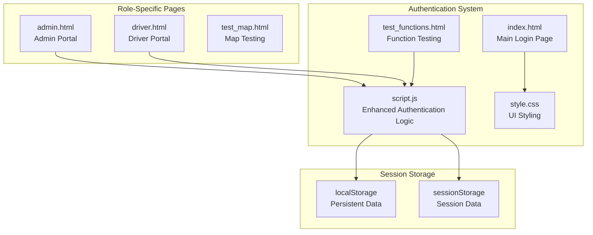

**Diagram sources**
- [index.html:15](file://index.html#L15)
- [script.js:364-388](file://script.js#L364-L388)
- [admin.html:176-188](file://admin.html#L176-L188)
- [driver.html:677-730](file://driver.html#L677-L730)

**Section sources**
- [index.html:15](file://index.html#L15)
- [script.js:364-388](file://script.js#L364-L388)
- [admin.html:176-188](file://admin.html#L176-L188)
- [driver.html:677-730](file://driver.html#L677-L730)

## Core Components

### Hardcoded User Credentials

The system maintains a centralized user database containing all valid credentials and role assignments:

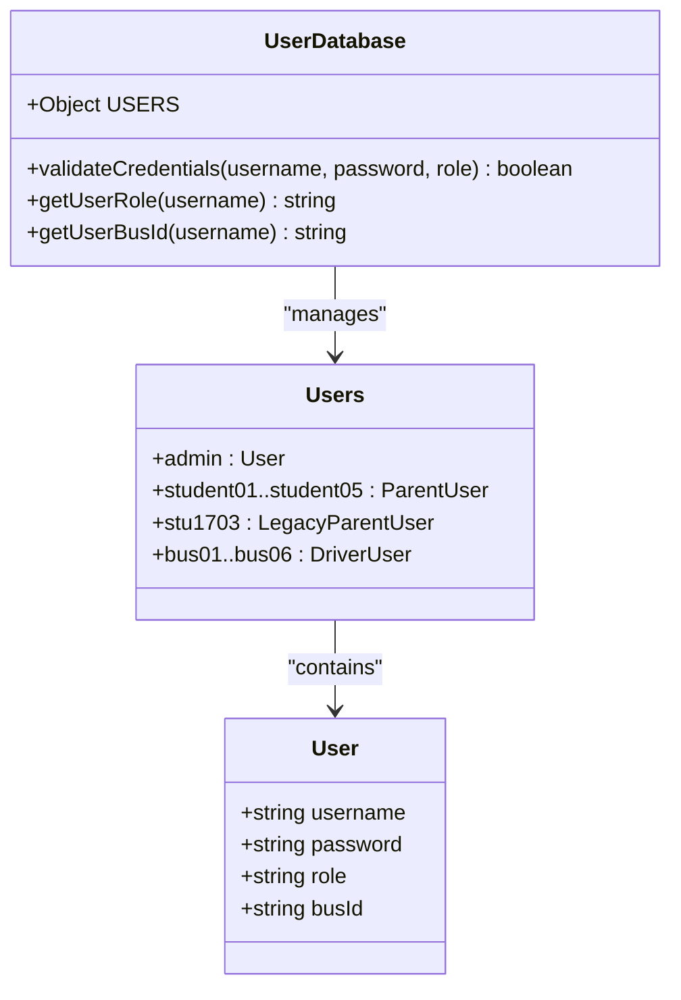

**Diagram sources**
- [script.js:43-57](file://script.js#L43-L57)

The user database includes:
- **Admin Account**: `admin` with password `schooladmin789`
- **Parent Accounts**: `student01` through `student05` with individual passwords
- **Legacy Parent Account**: `stu1703` with password `1703`
- **Driver Accounts**: `bus01` through `bus06` with password `drive123`

**Section sources**
- [script.js:43-57](file://script.js#L43-L57)

### Enhanced Session Management

The authentication system uses a sophisticated dual-storage approach for different types of data with improved session handling:

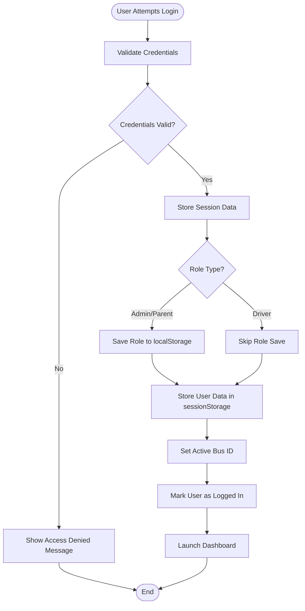

**Diagram sources**
- [script.js:89-133](file://script.js#L89-L133)
- [script.js:135-141](file://script.js#L135-L141)

**Section sources**
- [script.js:89-133](file://script.js#L89-L133)
- [script.js:135-141](file://script.js#L135-L141)

## Architecture Overview

The authentication system follows a client-side architecture with enhanced role-based routing and comprehensive function accessibility:

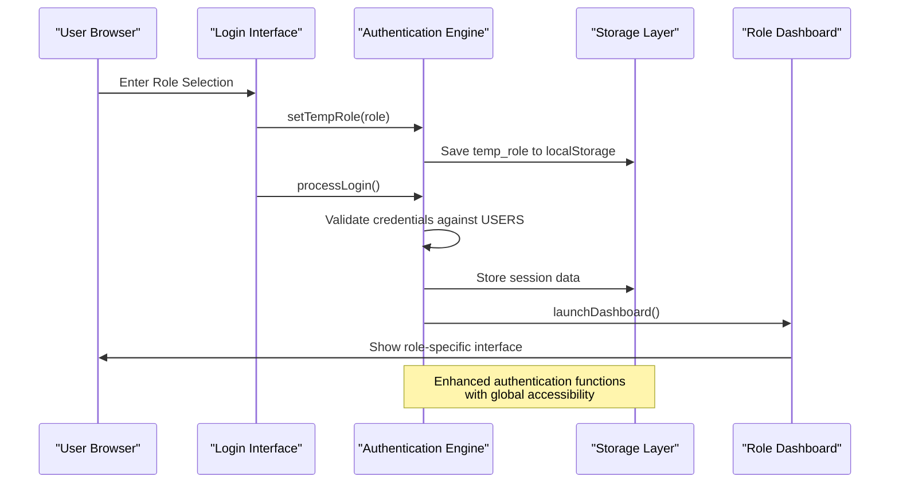

**Diagram sources**
- [script.js:72-87](file://script.js#L72-L87)
- [script.js:89-133](file://script.js#L89-L133)
- [index.html:48-59](file://index.html#L48-L59)

**Section sources**
- [script.js:72-87](file://script.js#L72-L87)
- [script.js:89-133](file://script.js#L89-L133)
- [index.html:48-59](file://index.html#L48-L59)

## Detailed Component Analysis

### Enhanced Login Flow Implementation

The login process consists of several distinct phases with comprehensive error handling:

#### Phase 1: Role Selection with Global Accessibility
Users first select their role through the role selection interface with guaranteed global function accessibility:

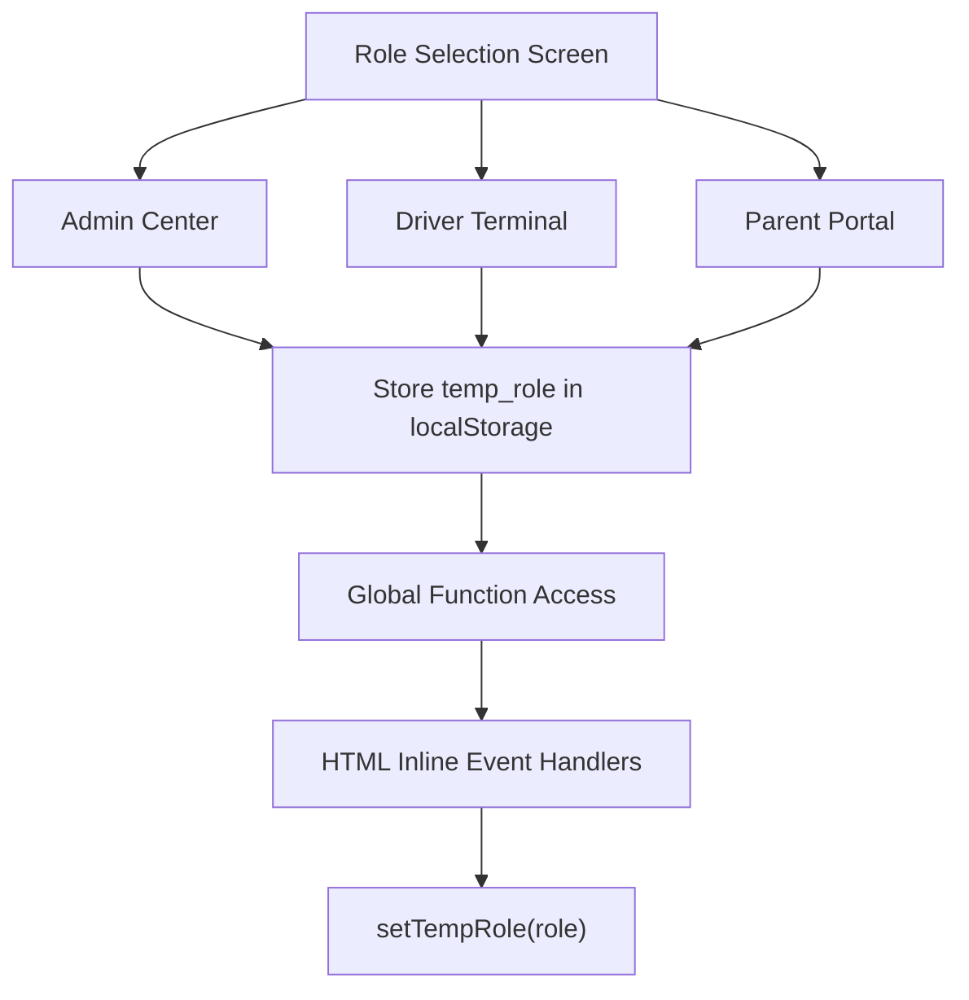

**Diagram sources**
- [index.html:48-51](file://index.html#L48-L51)
- [script.js:72-87](file://script.js#L72-L87)

#### Phase 2: Enhanced Credential Validation
The system validates user credentials against the hardcoded database with improved error handling:

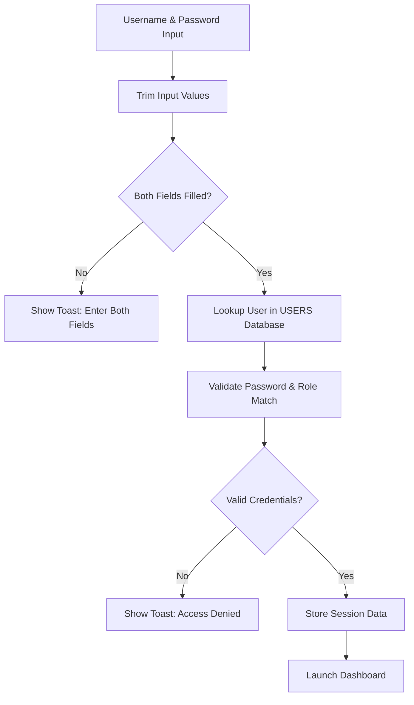

**Diagram sources**
- [script.js:89-133](file://script.js#L89-L133)

**Section sources**
- [index.html:54-59](file://index.html#L54-L59)
- [script.js:89-133](file://script.js#L89-L133)

### Role-Based Access Control

The system implements role-based access control with three distinct user types:

#### Admin Role (`admin`)
- **Credentials**: Username: `admin`, Password: `schooladmin789`
- **Permissions**: Full system access, can view all buses and fleet data
- **Interface**: Admin dashboard with comprehensive controls

#### Driver Role (`bus01`-`bus06`)
- **Credentials**: Username: `bus01`-`bus06`, Password: `drive123`
- **Permissions**: Access only their assigned bus, can publish trips and manage route data
- **Interface**: Driver terminal with bus-specific controls

#### Parent Role (`student01`-`student05`, `stu1703`)
- **Credentials**: Username: `student01`-`student05` or `stu1703`, Password: individual per student
- **Permissions**: Access only their child's bus, can view real-time location and ETA
- **Interface**: Parent portal with child-specific bus monitoring

**Section sources**
- [script.js:43-57](file://script.js#L43-L57)
- [admin.html:176-188](file://admin.html#L176-L188)

### Enhanced Session Management Strategy

The authentication system employs a sophisticated dual-storage approach with improved session persistence:

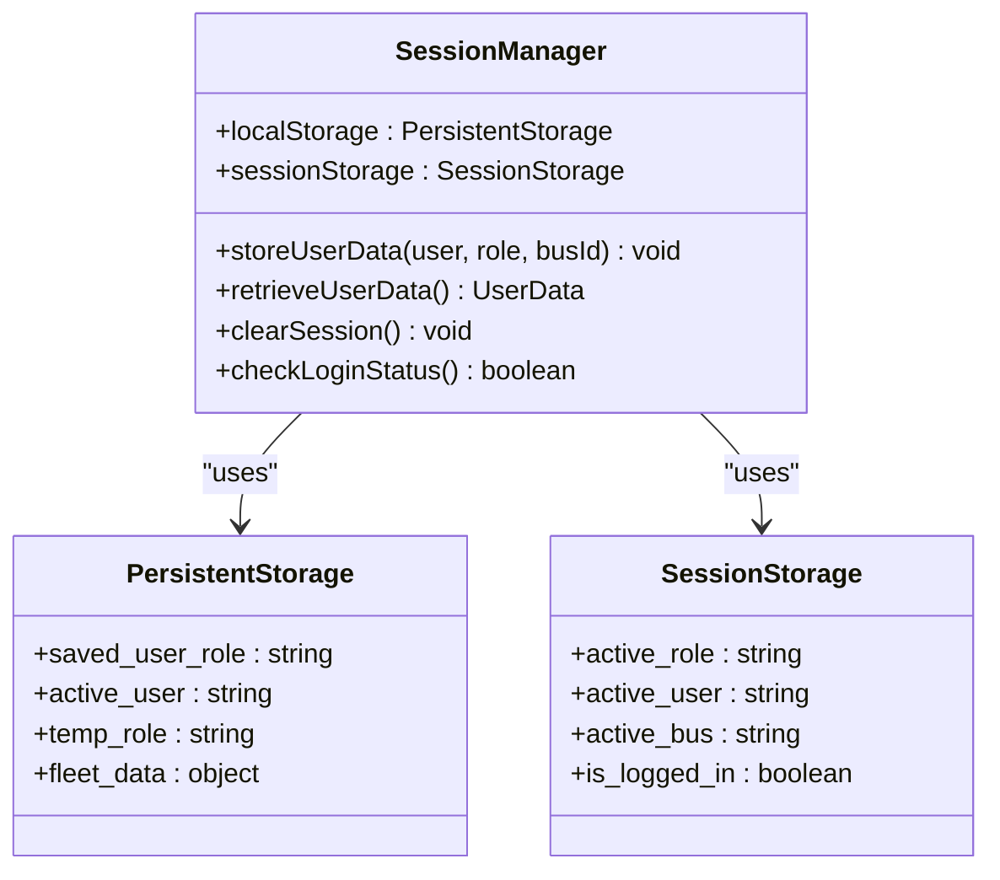

**Diagram sources**
- [script.js:135-141](file://script.js#L135-L141)
- [script.js:159-164](file://script.js#L159-L164)

**Section sources**
- [script.js:135-141](file://script.js#L135-L141)
- [script.js:159-164](file://script.js#L159-L164)

### Enhanced Dashboard Launch and Role Rendering

Upon successful authentication, the system launches the appropriate dashboard based on user role with improved user feedback:

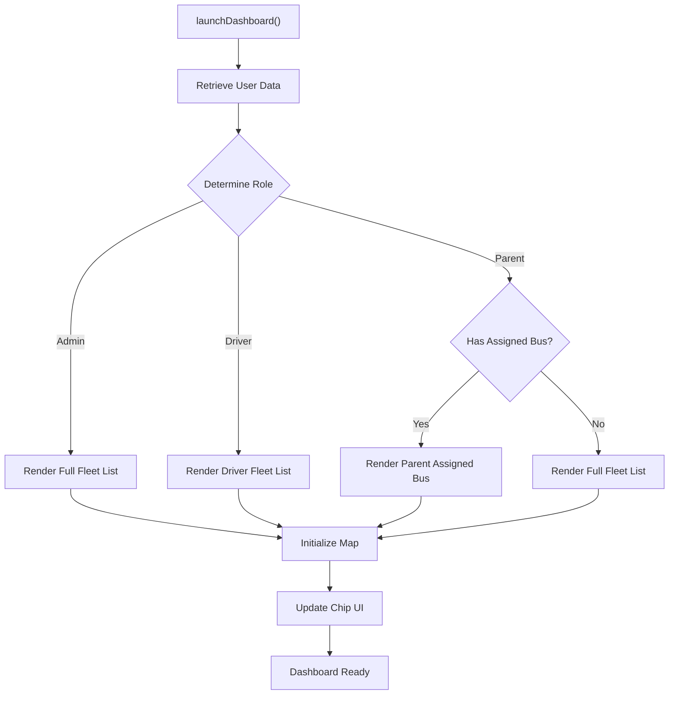

**Diagram sources**
- [script.js:143-157](file://script.js#L143-L157)
- [script.js:166-170](file://script.js#L166-L170)

**Section sources**
- [script.js:143-157](file://script.js#L143-L157)
- [script.js:166-170](file://script.js#L166-L170)

## Enhanced Authentication Functions

### New Authentication Functions

The system now includes six comprehensive authentication functions that handle different aspects of the authentication lifecycle:

#### processLogin Function
Handles the complete login process with credential validation and session management:

```javascript
function processLogin() {
    console.log("processLogin called");
    
    const role = localStorage.getItem("temp_role");
    const username = document.getElementById('username').value.trim().toLowerCase();
    const password = document.getElementById('password').value.trim();
    
    if (!username || !password) {
        alert("Please enter both username and password");
        return;
    }
    
    const user = USERS[username];
    
    if (user && user.password === password && user.role === role) {
        // Store session data and redirect based on role
    } else {
        alert("Access Denied: Invalid Credentials");
    }
}
```

#### resetLogin Function
Resets the login interface to allow role switching:

```javascript
function resetLogin() {
    console.log("resetLogin called");
    const roleSelection = document.getElementById('role-selection-v3');
    const authForm = document.getElementById('auth-form-v3');
    if (roleSelection) roleSelection.style.display = 'block';
    if (authForm) authForm.style.display = 'none';
}
```

#### logout Function
Comprehensive logout that clears all session data:

```javascript
function logout() {
    localStorage.removeItem('saved_user_role');
    localStorage.removeItem('temp_role');
    sessionStorage.clear();
    location.reload();
}
```

#### switchRole Function
Allows users to switch between different roles without full logout:

```javascript
function switchRole() {
    document.getElementById('app-container').style.display = 'none';
    document.getElementById('login-screen').style.display = 'flex';
    sessionStorage.clear();
}
```

#### showToast Function
Enhanced toast notification system with automatic dismissal:

```javascript
function showToast(message) {
    const toast = document.getElementById('toast');
    if (toast) {
        toast.innerText = message;
        toast.style.display = 'block';
        setTimeout(() => {
            toast.style.display = 'none';
        }, 3000);
    } else {
        alert(message);
    }
}
```

**Section sources**
- [script.js:89-133](file://script.js#L89-L133)
- [script.js:135-141](file://script.js#L135-L141)
- [script.js:159-164](file://script.js#L159-L164)
- [script.js:166-170](file://script.js#L166-L170)
- [script.js:172-183](file://script.js#L172-L183)

## Global Function Export System

### Enhanced Function Accessibility

The system now provides comprehensive global accessibility for all critical functions through explicit window object exports:

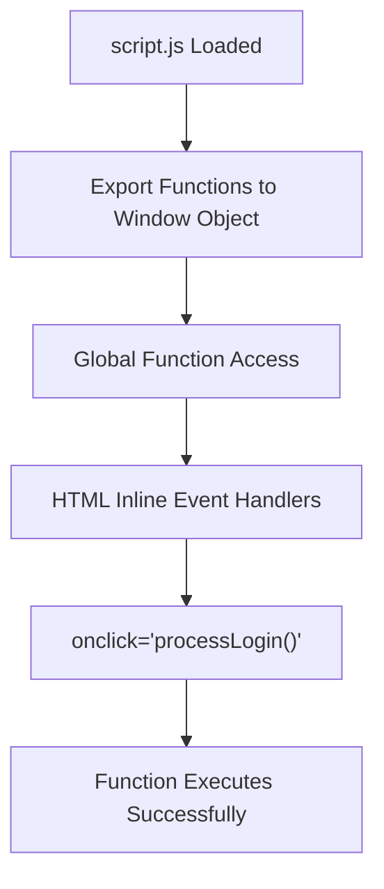

**Diagram sources**
- [script.js:364-388](file://script.js#L364-L388)
- [index.html:54-59](file://index.html#L54-L59)

### Exported Functions

The system exports the following functions globally:

- `setTempRole` - Role selection function
- `processLogin` - Main login validation function  
- `resetLogin` - Login interface reset function
- `logout` - Complete logout function
- `switchRole` - Role switching function
- `showToast` - Enhanced toast notification function
- Additional UI functions for bus management and map operations

**Section sources**
- [script.js:364-388](file://script.js#L364-L388)
- [index.html:54-59](file://index.html#L54-L59)

## Dependency Analysis

The authentication system has minimal external dependencies with enhanced function accessibility:

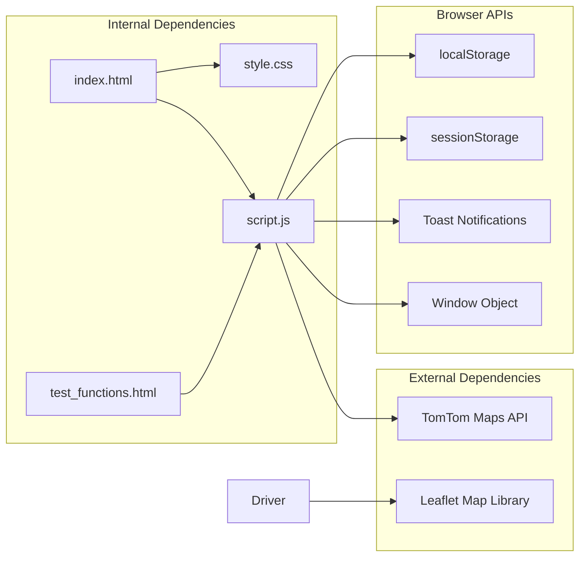

**Diagram sources**
- [script.js:364-388](file://script.js#L364-L388)
- [index.html:15](file://index.html#L15)
- [test_functions.html:16](file://test_functions.html#L16)

**Section sources**
- [script.js:364-388](file://script.js#L364-L388)
- [index.html:15](file://index.html#L15)
- [test_functions.html:16](file://test_functions.html#L16)

## Performance Considerations

The authentication system is designed for optimal performance with enhanced function accessibility:

### Memory Efficiency
- User database is stored in memory as a constant object
- No repeated network requests for authentication validation
- Minimal DOM manipulation during login process
- Efficient global function export system

### Storage Optimization
- localStorage used for persistent data (roles, user preferences)
- sessionStorage used for temporary session data
- Efficient data serialization using JSON
- Optimized session cleanup on logout

### UI Responsiveness
- Enhanced toast notifications provide immediate feedback
- Asynchronous operations for map initialization
- Debounced user interaction handling
- Comprehensive function accessibility improves event handler performance

## Security Considerations

### Current Security Limitations

The client-side authentication system has several security vulnerabilities:

#### 1. Hardcoded Credentials
- User credentials are visible in the source code
- Easy to extract and misuse by malicious users
- No password hashing or salting mechanisms

#### 2. Client-Side Validation Only
- All validation occurs in the browser
- Can be bypassed using browser developer tools
- No server-side verification of credentials

#### 3. Storage Security Issues
- Sensitive data stored in browser storage
- No encryption of stored credentials
- Vulnerable to XSS attacks

#### 4. Role Detection Vulnerabilities
- Role information stored in localStorage
- Can be easily modified by users
- No server-side role verification

### Enhanced Function Security Implications
The enhanced function export system provides controlled global accessibility while maintaining security boundaries. All exported functions are properly scoped and validated.

### Potential Attack Vectors

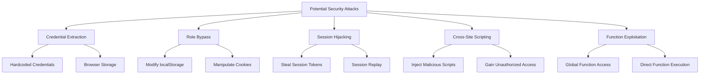

### Security Recommendations

#### Immediate Improvements
1. **Server-Side Authentication**: Implement backend validation
2. **Password Hashing**: Use bcrypt or similar for password storage
3. **HTTPS Enforcement**: Force secure connections only
4. **CSRF Protection**: Implement anti-CSRF tokens

#### Long-term Enhancements
1. **Token-Based Authentication**: JWT or OAuth implementation
2. **Rate Limiting**: Prevent brute force attacks
3. **Audit Logging**: Track authentication attempts
4. **Multi-Factor Authentication**: Add additional security layers

## Testing Credentials

### Available Test Accounts

The system provides predefined test accounts for development and demonstration:

#### Admin Credentials
- **Username**: `admin`
- **Password**: `schooladmin789`
- **Role**: Admin
- **Permissions**: Full system access

#### Driver Credentials
- **Username**: `bus01` through `bus06`
- **Password**: `drive123`
- **Role**: Driver
- **Permissions**: Access only assigned bus

#### Parent Credentials
- **Username**: `student01` through `student05`
- **Password**: `pass01` through `pass05`
- **Role**: Parent
- **Permissions**: Access only assigned child's bus

#### Legacy Parent Credentials
- **Username**: `stu1703`
- **Password**: `1703`
- **Role**: Parent
- **Permissions**: Access all buses

**Section sources**
- [script.js:43-57](file://script.js#L43-L57)
- [admin.html:176-188](file://admin.html#L176-L188)

## Troubleshooting Guide

### Common Authentication Issues

#### Login Failures
**Symptoms**: "Access Denied: Invalid Credentials" message appears
**Causes**:
- Incorrect username or password
- Wrong role selected for the account
- Case sensitivity issues
- Special characters in credentials

**Solutions**:
1. Verify username and password match exactly
2. Ensure correct role is selected before login
3. Check for extra spaces or special characters
4. Use the exact credentials from the test accounts list

#### Session Persistence Issues
**Symptoms**: Users logged out unexpectedly
**Causes**:
- Browser clearing local/session storage
- Multiple tabs causing session conflicts
- Browser privacy settings blocking storage

**Solutions**:
1. Check browser storage permissions
2. Close other tabs using the application
3. Disable browser extensions that block storage
4. Clear browser cache and cookies

#### Role Assignment Problems
**Symptoms**: Wrong dashboard appears after login
**Causes**:
- Role not properly stored in localStorage
- Session data corruption
- Browser storage limitations

**Solutions**:
1. Clear browser storage and retry login
2. Check browser console for JavaScript errors
3. Verify localStorage availability
4. Restart browser session

#### Dashboard Loading Issues
**Symptoms**: Dashboard loads but shows blank interface
**Causes**:
- Map API initialization failures
- Network connectivity issues
- Storage data corruption

**Solutions**:
1. Check network connectivity
2. Verify TomTom API key validity
3. Clear localStorage and retry
4. Check browser console for API errors

#### Enhanced Function Accessibility Issues
**Symptoms**: "processLogin is not defined" or similar function errors
**Causes**:
- script.js not loaded before function calls
- Global function export failures
- HTML inline event handler compatibility issues

**Solutions**:
1. Ensure script.js is loaded before any inline event handlers
2. Verify all functions are properly exported to window object
3. Check browser console for function accessibility errors
4. Use the test_functions.html page to verify function availability

**Section sources**
- [script.js:135-141](file://script.js#L135-L141)
- [script.js:159-164](file://script.js#L159-L164)
- [test_functions.html:16-29](file://test_functions.html#L16-L29)

## Conclusion

The BusTrack MB Pro authentication system provides a comprehensive client-side multi-role authentication solution with the following characteristics:

### Strengths
- **Enhanced Functionality**: Six comprehensive authentication functions with proper error handling
- **Improved Accessibility**: Global function export system ensures reliable HTML inline event handler compatibility
- **Robust Session Management**: Sophisticated dual-storage approach with proper session persistence
- **Enhanced User Experience**: Comprehensive toast notification system and responsive UI
- **Scalable Architecture**: Modular design supports easy extension and maintenance

### Limitations
- **Security Vulnerabilities**: Client-side only validation remains a concern
- **Limited Scalability**: Hardcoded credentials not suitable for production environments
- **Maintenance Challenges**: Credentials embedded in source code require careful management
- **No Audit Trail**: No logging of authentication events or security incidents

### Recommendations for Production Use

For production deployment, consider implementing:

1. **Server-Side Authentication**: Move validation to backend with proper security measures
2. **Database Integration**: Replace hardcoded credentials with secure database storage
3. **Encryption**: Implement proper password hashing and secure session management
4. **API Security**: Add authentication middleware and comprehensive authorization checks
5. **Monitoring**: Implement audit logging and security incident monitoring
6. **Modern Architecture**: Consider migrating to a proper module system instead of global functions

The current implementation serves as an excellent foundation for learning client-side authentication patterns and can be adapted for educational purposes or internal development environments with appropriate security modifications. The enhanced function export system and comprehensive authentication functions provide a solid base for future security improvements and architectural evolution.