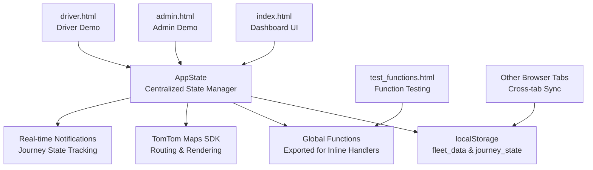
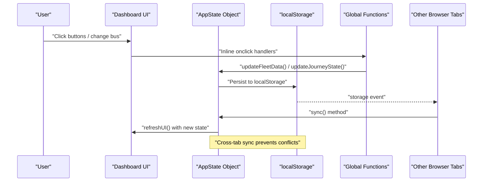
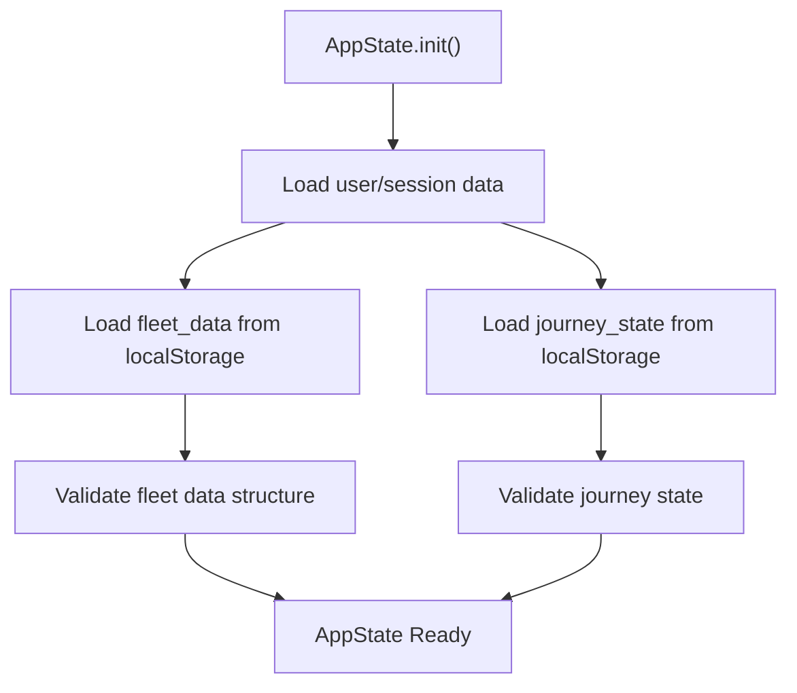
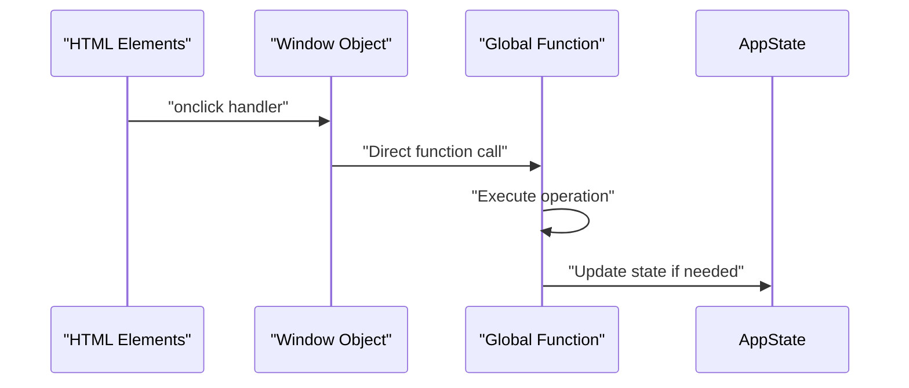
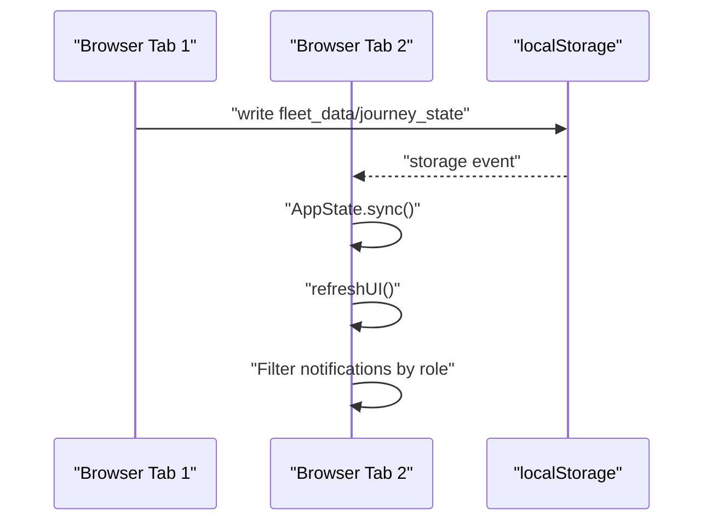
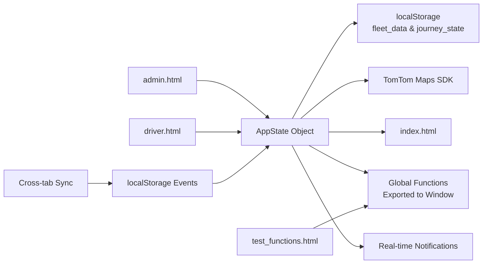

# Data Management and Persistence

<cite>
**Referenced Files in This Document**
- [script.js](file://script.js)
- [index.html](file://index.html)
- [style.css](file://style.css)
- [admin.html](file://admin.html)
- [driver.html](file://driver.html)
- [test_functions.html](file://test_functions.html)
</cite>

## Update Summary
**Changes Made**
- Updated to reflect enhanced centralized state management system with AppState object as single source of truth
- Added documentation for comprehensive function export system enabling inline onclick handlers
- Enhanced dual persistence model with improved integration between fleet_data and journey_state
- Documented comprehensive testing framework with dedicated test_functions.html
- Updated real-time notification system with journey state tracking and simulation capabilities
- Improved role-based access control with centralized filtering through AppState

## Table of Contents
1. [Introduction](#introduction)
2. [Project Structure](#project-structure)
3. [Core Components](#core-components)
4. [Architecture Overview](#architecture-overview)
5. [Detailed Component Analysis](#detailed-component-analysis)
6. [Dependency Analysis](#dependency-analysis)
7. [Performance Considerations](#performance-considerations)
8. [Troubleshooting Guide](#troubleshooting-guide)
9. [Conclusion](#conclusion)
10. [Appendices](#appendices)

## Introduction
This document explains the advanced data management and persistence system built around a centralized AppState object that serves as the single source of truth for fleet data. The system features comprehensive function accessibility for inline onclick handlers, cross-tab synchronization, role-based access control, real-time notifications, and comprehensive data validation. It covers the fleet data structure, initialization, synchronization, state management, real-time updates, conflict prevention, validation, error handling, and fallbacks. It also outlines scalability considerations and migration paths to more robust storage solutions.

## Project Structure
The application consists of:
- A centralized state management system with AppState object as the core orchestrator
- Comprehensive function export system enabling inline onclick handlers
- Cross-tab synchronization using localStorage events for real-time updates
- Role-based access control with session-based separation
- Dual persistence model: localStorage for fleet_data and journey_state
- Real-time notification system with journey tracking and simulation
- Dedicated testing framework for function validation

**Diagram sources**
- [script.js:1813-1950](file://script.js#L1813-L1950)
- [script.js:2123-2146](file://script.js#L2123-L2146)
- [script.js:403-430](file://script.js#L403-L430)
- [index.html:1-238](file://index.html#L1-L238)
- [admin.html:1-34](file://admin.html#L1-L34)
- [driver.html:1-732](file://driver.html#L1-L732)
- [test_functions.html:1-32](file://test_functions.html#L1-L32)

**Section sources**
- [script.js:1813-1950](file://script.js#L1813-L1950)
- [script.js:2123-2146](file://script.js#L2123-L2146)
- [script.js:403-430](file://script.js#L403-L430)
- [index.html:1-238](file://index.html#L1-L238)

## Core Components
- **AppState Object**: Centralized state manager serving as the single source of truth for all fleet data and journey state
- **Comprehensive Function Export System**: All functions exported to global scope for inline onclick handlers
- **Cross-tab Synchronization**: Real-time updates across multiple browser tabs using localStorage events
- **Dual Persistence Model**: Separate localStorage keys for fleet_data and journey_state with automatic synchronization
- **Role-based Access Control**: Session-based filtering of buses based on user roles (admin, driver, parent)
- **Enhanced Data Validation**: Comprehensive validation for coordinates, route calculations, and state consistency
- **Real-time Notifications**: Journey state tracking with automated notifications for bus movements
- **Step-by-step Journey Simulation**: Comprehensive testing framework for journey state progression
- **Session-based Separation**: Role and active user stored in sessionStorage/localStorage for context isolation

**Section sources**
- [script.js:182-272](file://script.js#L182-L272)
- [script.js:2123-2146](file://script.js#L2123-L2146)
- [script.js:403-430](file://script.js#L403-L430)
- [script.js:1813-1950](file://script.js#L1813-L1950)
- [script.js:1952-2011](file://script.js#L1952-L2011)

## Architecture Overview
The system uses a centralized AppState object as the single source of truth, with localStorage serving as the persistent store. Cross-tab synchronization ensures real-time updates across multiple browser sessions. The system implements role-based access control and comprehensive data validation. All functions are exported globally to support inline onclick handlers for seamless user interaction.

**Diagram sources**
- [script.js:2123-2146](file://script.js#L2123-L2146)
- [script.js:403-430](file://script.js#L403-L430)
- [script.js:1284-1303](file://script.js#L1284-L1303)

## Detailed Component Analysis

### Enhanced Centralized State Management System
The AppState object serves as the single source of truth for all application state, managing:
- **currentUser**: Currently authenticated user
- **userRole**: Role-based permissions (admin, driver, parent)
- **assignedBusId**: Bus assignment for parent/driver users
- **activeBusId**: Currently selected bus in UI
- **fleetData**: Complete fleet information with validation
- **journeyState**: Real-time journey tracking and notifications

**Diagram sources**
- [script.js:191-205](file://script.js#L191-L205)
- [script.js:166-172](file://script.js#L166-L172)

**Section sources**
- [script.js:182-272](file://script.js#L182-L272)
- [script.js:191-205](file://script.js#L191-L205)

### Comprehensive Function Export System
The system exports all functions to global scope to support inline onclick handlers:

- **Global Function Registration**: All functions registered in window object
- **Inline Handler Support**: Direct function calls from HTML onclick attributes
- **Testing Framework Integration**: Dedicated test_functions.html validates function accessibility
- **Consistent API Surface**: Unified interface for both programmatic and UI-triggered operations

**Diagram sources**
- [script.js:2123-2146](file://script.js#L2123-L2146)
- [test_functions.html:16-28](file://test_functions.html#L16-L28)

**Section sources**
- [script.js:2123-2146](file://script.js#L2123-L2146)
- [test_functions.html:16-28](file://test_functions.html#L16-L28)

### Cross-tab Synchronization
The system implements real-time synchronization across multiple browser tabs using localStorage events:

- **Event Listener**: Listens for 'journey_state' and 'fleet_data' key changes
- **Automatic Sync**: Calls AppState.sync() to refresh state from localStorage
- **Notification Filtering**: Only shows notifications for user's assigned bus
- **UI Refresh**: Automatically updates UI components when state changes

**Diagram sources**
- [script.js:403-430](file://script.js#L403-L430)
- [script.js:1284-1303](file://script.js#L1284-L1303)

**Section sources**
- [script.js:403-430](file://script.js#L403-L430)
- [script.js:1284-1303](file://script.js#L1284-L1303)

### Role-based Access Control
The system implements comprehensive role-based filtering:

- **Admin Users**: Can view all buses and all notifications
- **Driver Users**: Can only view their assigned bus
- **Parent Users**: Can only view their assigned child's bus
- **Permission Checking**: `canViewBus()` and `shouldShowNotification()` methods
- **Dynamic Filtering**: Automatic filtering in fleet list rendering

**Section sources**
- [script.js:136-154](file://script.js#L136-L154)
- [script.js:657-705](file://script.js#L657-L705)

### Enhanced Data Validation and Error Handling
The system implements comprehensive validation:

- **Coordinate Validation**: NaN checks, range validation, and type checking
- **Route Calculation Validation**: API response validation and error handling
- **State Consistency**: Atomic updates with localStorage persistence
- **Fallback Mechanisms**: Graceful degradation with default values
- **User Feedback**: Toast notifications for success/error states

**Section sources**
- [script.js:920-925](file://script.js#L920-L925)
- [script.js:1010-1029](file://script.js#L1010-L1029)
- [script.js:1192-1195](file://script.js#L1192-L1195)

### Real-time Notification System
The system tracks journey state with automated notifications:

- **Journey Events**: Bus started, approaching stops, reached stops, smart arrival alerts
- **State Persistence**: Journey state stored separately from fleet data
- **Notification Filtering**: Role-based notification visibility
- **Step-by-step Journey Simulation**: Comprehensive testing framework for journey progression
- **Integration with AppState**: All notifications go through centralized state management

**Section sources**
- [script.js:1813-1950](file://script.js#L1813-L1950)
- [script.js:1952-2011](file://script.js#L1952-L2011)

### Dual Persistence Model
The system uses separate localStorage keys for different data types:

- **fleet_data**: Complete fleet information with coordinates, route details, and ETAs
- **journey_state**: Real-time journey tracking with status, stops, and timing
- **Atomic Operations**: Separate update methods for each data type
- **Cross-tab Sync**: Independent synchronization for each data type

**Section sources**
- [script.js:156-172](file://script.js#L156-L172)
- [script.js:248-272](file://script.js#L248-L272)

## Dependency Analysis
- script.js depends on:
  - localStorage for dual persistence (fleet_data and journey_state)
  - sessionStorage/localStorage for session and role state
  - TomTom Maps SDK for geocoding and routing
  - index.html for DOM elements and UI structure
  - Real-time notification system for journey tracking
  - Global function export system for inline onclick handlers
- style.css provides UI styling for the dashboard and modals
- Cross-tab synchronization relies on browser storage events
- test_functions.html provides testing infrastructure for function validation

**Diagram sources**
- [script.js:182-272](file://script.js#L182-L272)
- [script.js:2123-2146](file://script.js#L2123-L2146)
- [index.html:1-238](file://index.html#L1-L238)
- [style.css:1-2440](file://style.css#L1-L2440)
- [admin.html:1-34](file://admin.html#L1-L34)
- [driver.html:1-732](file://driver.html#L1-L732)
- [test_functions.html:1-32](file://test_functions.html#L1-L32)

**Section sources**
- [script.js:182-272](file://script.js#L182-L272)
- [script.js:2123-2146](file://script.js#L2123-L2146)
- [index.html:1-238](file://index.html#L1-L238)
- [style.css:1-2440](file://style.css#L1-L2440)

## Performance Considerations
- **Centralized State**: Single source of truth reduces data inconsistency and improves performance
- **Cross-tab Optimization**: Event-driven updates minimize unnecessary UI refreshes
- **Dual Persistence**: Separate localStorage keys reduce write contention and improve atomicity
- **Validation Efficiency**: Early validation prevents expensive API calls and UI updates
- **Memory Management**: Proper cleanup of route layers and markers prevents memory leaks
- **Function Export Overhead**: Global function registration adds minimal overhead for enhanced usability
- **Testing Framework**: Dedicated test page enables efficient function validation without affecting main application

## Troubleshooting Guide
Common issues and resolutions:
- **AppState Not Initialized**:
  - Cause: Missing AppState.init() call
  - Resolution: Ensure AppState.init() is called during login process
- **Cross-tab Updates Not Working**:
  - Cause: Storage event listener not firing
  - Resolution: Check browser support for storage events and localStorage availability
- **Role-based Filtering Issues**:
  - Cause: Incorrect user assignment or session data
  - Resolution: Verify user credentials and session storage values
- **Journey State Synchronization**:
  - Cause: Separate localStorage keys not updating consistently
  - Resolution: Use AppState.updateJourneyState() for atomic updates
- **Notification Visibility Problems**:
  - Cause: Role-based notification filtering blocking legitimate notifications
  - Resolution: Verify user role and assigned bus configuration
- **Function Accessibility Issues**:
  - Cause: Functions not properly exported to global scope
  - Resolution: Check window.functionName assignments in global export section
- **Testing Framework Failures**:
  - Cause: test_functions.html not loading script.js correctly
  - Resolution: Verify script.js path and function export order

**Section sources**
- [script.js:2123-2146](file://script.js#L2123-L2146)
- [script.js:403-430](file://script.js#L403-L430)
- [test_functions.html:16-28](file://test_functions.html#L16-L28)

## Conclusion
The system now provides a robust, scalable foundation for fleet data management with centralized state control, comprehensive function accessibility, cross-tab synchronization, comprehensive role-based access, and real-time journey tracking. The dual persistence model ensures data integrity while the centralized AppState object provides a clear, maintainable architecture for future enhancements. The dedicated testing framework and global function export system enhance development and maintenance efficiency.

## Appendices

### AppState Object API Reference
- **init()**: Initialize state from localStorage/sessionStorage
- **updateFleetData(busId, updates)**: Update fleet data atomically
- **updateJourneyState(busId, updates)**: Update journey state atomically
- **sync()**: Refresh state from localStorage
- **canViewBus(busId)**: Check role-based access
- **shouldShowNotification(busId)**: Filter notifications by role
- **getUserAssignedBus()**: Get user's assigned bus from configuration
- **getBusStatus(busId)**: Get LIVE/OFFLINE status for bus

**Section sources**
- [script.js:191-205](file://script.js#L191-L205)
- [script.js:233-272](file://script.js#L233-L272)

### Data Models
- **fleet_data**: Complete fleet information with coordinates, route details, and ETAs
- **journey_state**: Real-time journey tracking with status, stops, and timing
- **AppState Structure**: Centralized state management with role-based filtering
- **Notification System**: Journey state tracking with step-by-step simulation

**Section sources**
- [script.js:182-272](file://script.js#L182-L272)
- [script.js:1813-1950](file://script.js#L1813-L1950)

### Function Export System
- **Global Registration**: All functions exported to window object
- **Inline Handler Support**: Direct function calls from HTML onclick attributes
- **Testing Infrastructure**: Dedicated test_functions.html for function validation
- **API Surface**: Unified interface for programmatic and UI-triggered operations

**Section sources**
- [script.js:2123-2146](file://script.js#L2123-L2146)
- [test_functions.html:16-28](file://test_functions.html#L16-L28)

### Scalability and Migration Paths
- **Current Architecture Benefits**:
  - Centralized state management with clear separation of concerns
  - Cross-tab synchronization for multi-session environments
  - Role-based access control for security
  - Real-time notification system for user engagement
  - Comprehensive function export system for enhanced usability
  - Dedicated testing framework for development efficiency
- **Future Enhancement Opportunities**:
  - Server-side state synchronization for distributed environments
  - WebSocket integration for real-time updates beyond browser tabs
  - Database migration with localStorage as cache layer
  - Advanced conflict resolution for multi-user scenarios
  - Schema versioning and migration system
  - Enhanced testing framework with automated test suites