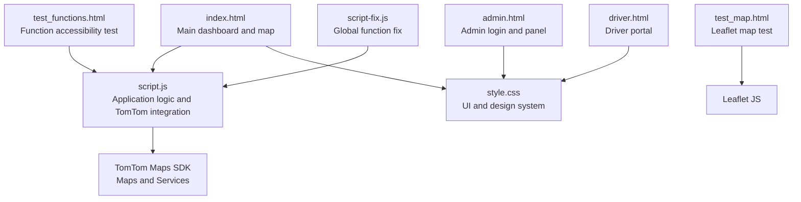
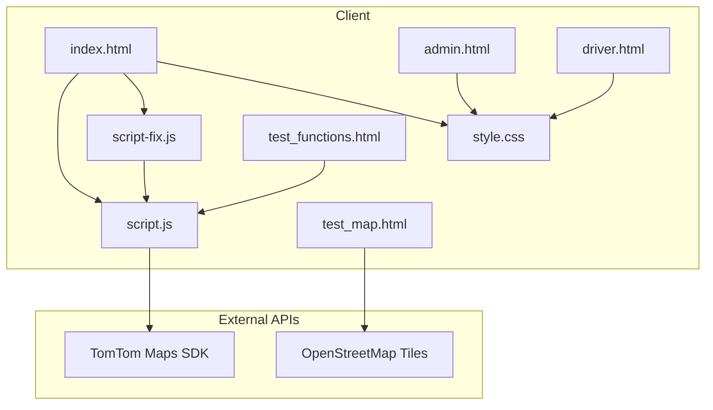
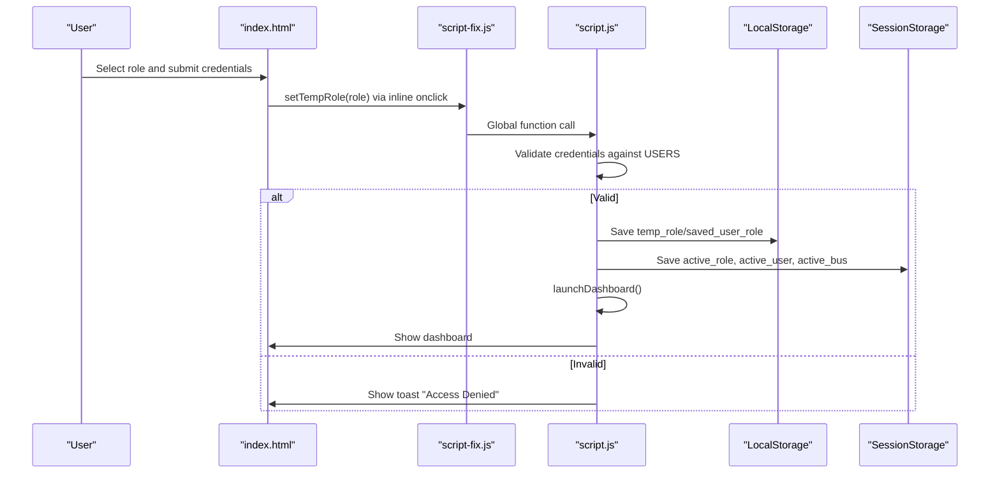
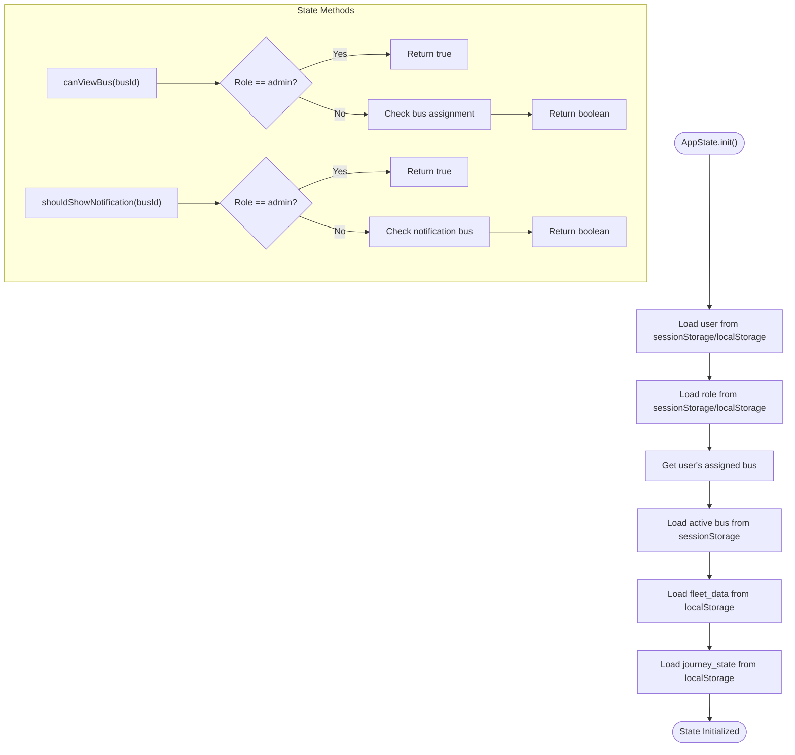
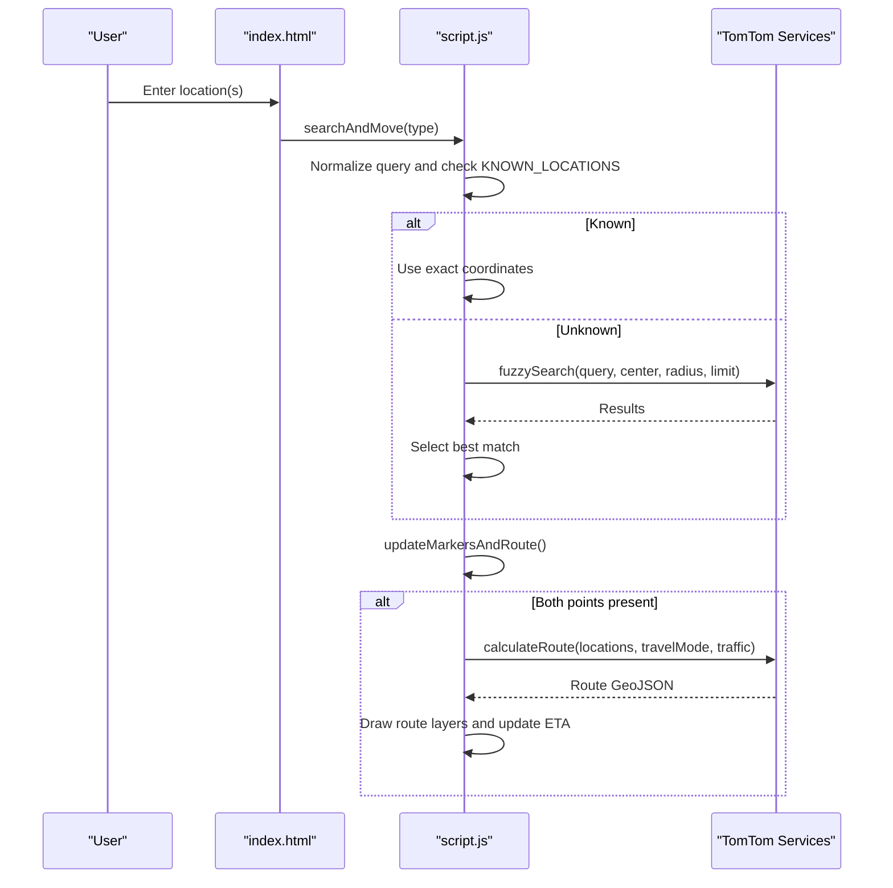
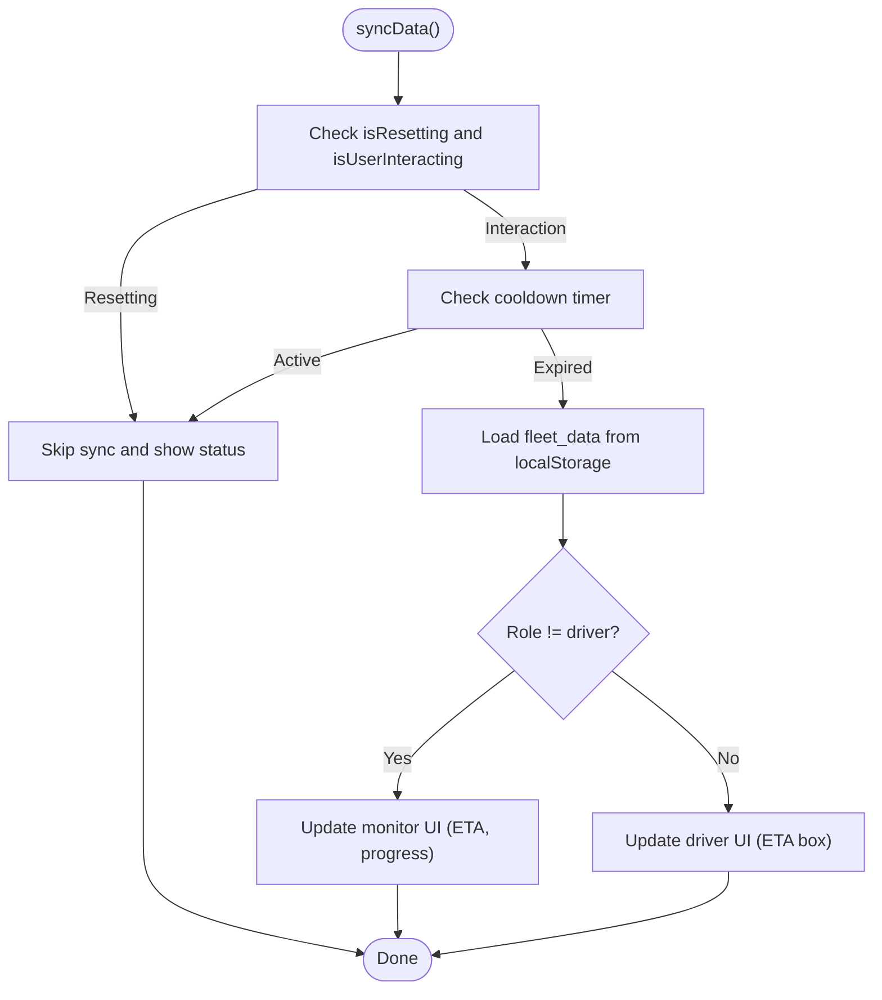
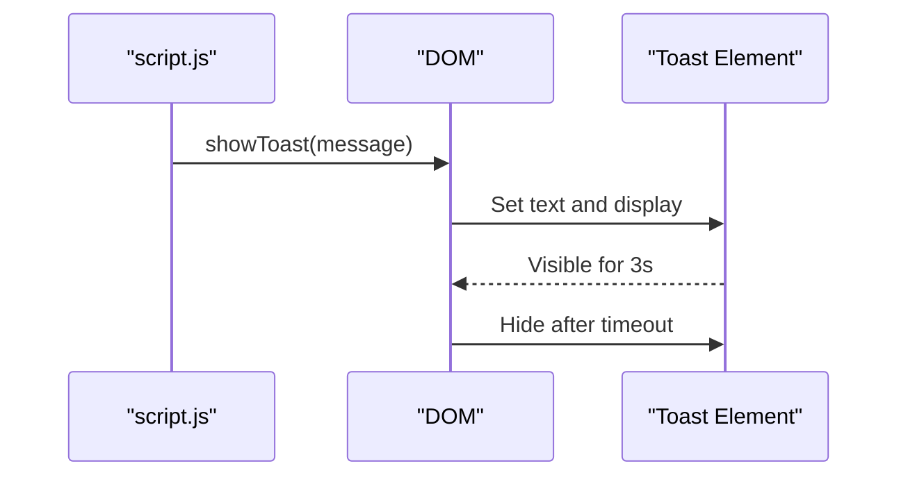
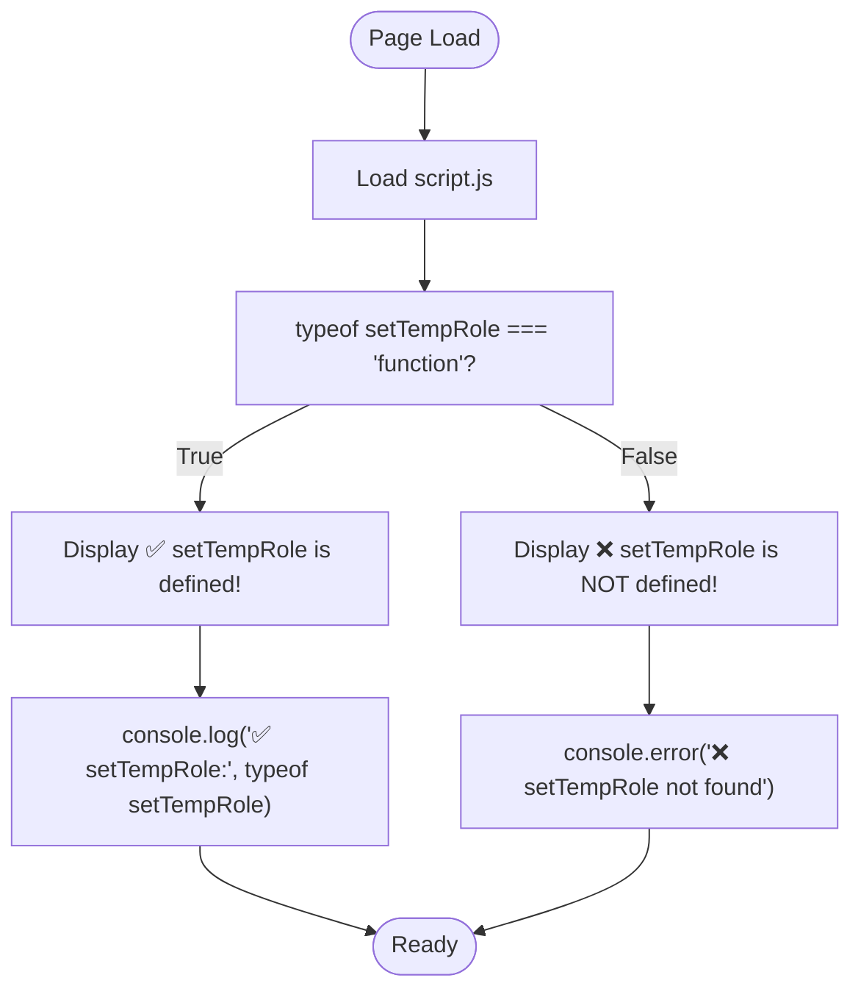
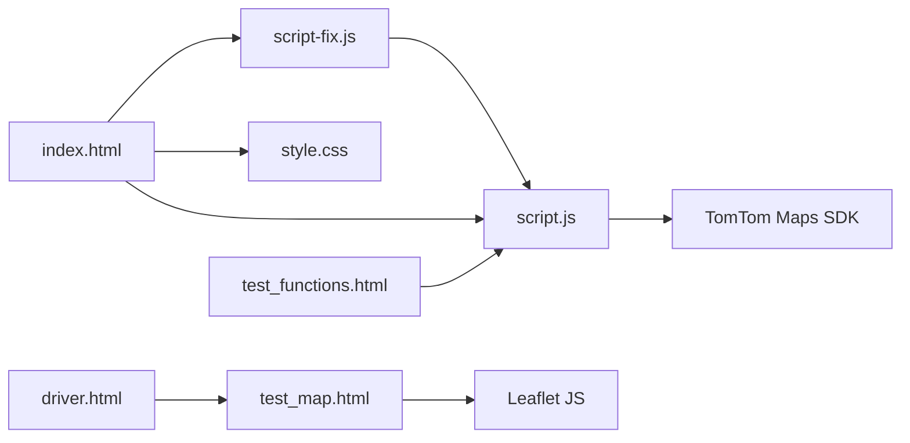

# Development and Testing

<cite>
**Referenced Files in This Document**
- [index.html](file://index.html)
- [script.js](file://script.js)
- [script-fix.js](file://script-fix.js)
- [style.css](file://style.css)
- [admin.html](file://admin.html)
- [driver.html](file://driver.html)
- [test_map.html](file://test_map.html)
- [test_functions.html](file://test_functions.html)
</cite>

## Update Summary
**Changes Made**
- Added comprehensive testing capabilities for the centralized state management system
- Included new test file test_functions.html for validating function accessibility and setTempRole functionality
- Enhanced documentation for the global function export mechanism and state management testing
- Updated troubleshooting guide with specific guidance for function accessibility issues

## Table of Contents
1. [Introduction](#introduction)
2. [Project Structure](#project-structure)
3. [Core Components](#core-components)
4. [Architecture Overview](#architecture-overview)
5. [Detailed Component Analysis](#detailed-component-analysis)
6. [Dependency Analysis](#dependency-analysis)
7. [Performance Considerations](#performance-considerations)
8. [Troubleshooting Guide](#troubleshooting-guide)
9. [Conclusion](#conclusion)
10. [Appendices](#appendices)

## Introduction
This document provides comprehensive guidance for development workflows and testing procedures for the BusTrack MB Pro application. It covers the standalone map testing utility (test_map.html), development environment setup, browser compatibility testing, debugging techniques for TomTom API integration, testing strategies for different user roles, location search functionality, route calculation accuracy, error handling patterns, console logging, and user feedback via toast notifications. It also outlines development tools and techniques for customizing the UI design system and extending functionality, along with troubleshooting guides for common issues such as API key problems, coordinate accuracy, and performance optimization.

**Updated** Added comprehensive testing capabilities for the centralized state management system and function export mechanism, including validation of function accessibility and setTempRole functionality through dedicated test utilities.

## Project Structure
The project is a client-side web application composed of HTML pages, a shared JavaScript runtime, and a centralized stylesheet. The main application entry point is index.html, which integrates TomTom Maps SDK for map rendering and routing. Supporting pages include admin.html for administrative access and driver.html for driver-specific functionality. A dedicated test_map.html provides a minimal Leaflet-based map test for network and map loading verification. A new test_functions.html validates function accessibility and setTempRole functionality for comprehensive testing of the centralized state management system.



**Diagram sources**
- [index.html:1-240](file://index.html#L1-L240)
- [script.js:1-2146](file://script.js#L1-L2146)
- [style.css:1-901](file://style.css#L1-L901)
- [admin.html:1-34](file://admin.html#L1-L34)
- [driver.html:1-732](file://driver.html#L1-L732)
- [test_map.html:1-51](file://test_map.html#L1-L51)
- [test_functions.html:1-32](file://test_functions.html#L1-L32)
- [script-fix.js:1-44](file://script-fix.js#L1-L44)

**Section sources**
- [index.html:1-240](file://index.html#L1-L240)
- [script.js:1-2146](file://script.js#L1-L2146)
- [style.css:1-901](file://style.css#L1-L901)
- [admin.html:1-34](file://admin.html#L1-L34)
- [driver.html:1-732](file://driver.html#L1-L732)
- [test_map.html:1-51](file://test_map.html#L1-L51)
- [test_functions.html:1-32](file://test_functions.html#L1-L32)
- [script-fix.js:1-44](file://script-fix.js#L1-L44)

## Core Components
- Authentication and Role Management
  - Client-side authentication against hardcoded credentials with role-based access.
  - Session and local storage management for active role, user, and bus selection.
  - Centralized state management system with single source of truth for all application state.
- Map and Routing Engine
  - TomTom Maps SDK integration for map rendering and routing.
  - Local storage-backed fleet data with start/end coordinates and ETA.
- UI and UX
  - Glassmorphism design system with toast notifications and modal overlays.
  - Role-specific dashboards (parent, driver, admin) with dynamic UI updates.
- Testing Utilities
  - Standalone Leaflet-based map test for network and tile loading verification.
  - Comprehensive function accessibility testing for centralized state management validation.

**Updated** Enhanced with centralized state management system and comprehensive function accessibility testing capabilities.

**Section sources**
- [script.js:43-172](file://script.js#L43-L172)
- [script.js:174-200](file://script.js#L174-L200)
- [script.js:207-570](file://script.js#L207-L570)
- [style.css:137-795](file://style.css#L137-L795)
- [test_map.html:1-51](file://test_map.html#L1-L51)
- [test_functions.html:1-32](file://test_functions.html#L1-L32)

## Architecture Overview
The application follows a modular client-side architecture with enhanced state management and testing capabilities:
- index.html orchestrates the login, role selection, and dashboard views with global function accessibility.
- script.js encapsulates all application logic, including authentication, map initialization, search and routing, data synchronization, and UI updates.
- script-fix.js provides critical global function exports to ensure inline onclick handlers work correctly.
- style.css defines the design system and responsive layout.
- admin.html and driver.html provide role-specific portals with simplified UIs.
- test_map.html isolates map rendering for quick diagnostics.
- test_functions.html validates function accessibility and centralized state management functionality.



**Diagram sources**
- [index.html:1-240](file://index.html#L1-L240)
- [script.js:1-2146](file://script.js#L1-L2146)
- [script-fix.js:1-44](file://script-fix.js#L1-L44)
- [style.css:1-901](file://style.css#L1-L901)
- [admin.html:1-34](file://admin.html#L1-L34)
- [driver.html:1-732](file://driver.html#L1-L732)
- [test_map.html:1-51](file://test_map.html#L1-L51)
- [test_functions.html:1-32](file://test_functions.html#L1-L32)

## Detailed Component Analysis

### Authentication and Role Management
- Hardcoded users and roles are validated client-side.
- Temporary role selection is persisted until login; session storage holds active role and user.
- Role-specific fleet lists are rendered dynamically based on user role and assignment.
- Centralized state management ensures single source of truth for all application state.

**Updated** Enhanced with centralized state management system that maintains consistency across all components.



**Diagram sources**
- [index.html:49-52](file://index.html#L49-L52)
- [script-fix.js:22-34](file://script-fix.js#L22-L34)
- [script.js:76-112](file://script.js#L76-L112)
- [script.js:119-152](file://script.js#L119-L152)

**Section sources**
- [script.js:43-172](file://script.js#L43-L172)
- [script.js:174-200](file://script.js#L174-L200)
- [script.js:119-152](file://script.js#L119-L152)
- [index.html:49-52](file://index.html#L49-L52)
- [script-fix.js:22-34](file://script-fix.js#L22-L34)

### Centralized State Management System
- Single source of truth architecture ensures consistent state across all components.
- AppState object manages user roles, assigned buses, fleet data, and journey state.
- Automatic persistence to localStorage/sessionStorage with sync capabilities.
- Role-based access control with canViewBus and shouldShowNotification methods.

**New** Comprehensive centralized state management system with single source of truth architecture.



**Diagram sources**
- [script.js:104-172](file://script.js#L104-L172)
- [script.js:136-154](file://script.js#L136-L154)
- [script.js:148-154](file://script.js#L148-L154)

**Section sources**
- [script.js:104-172](file://script.js#L104-L172)
- [script.js:136-154](file://script.js#L136-L154)
- [script.js:148-154](file://script.js#L148-L154)

### TomTom Search API and Routing
- Known locations are mapped to exact coordinates for improved accuracy.
- For unknown locations, the fuzzy search API is used with region and language constraints.
- Route calculation uses TomTom Services with bus travel mode and traffic-aware routing.
- Route layers are layered with glow and highlight effects for visual clarity.



**Diagram sources**
- [script.js:228-364](file://script.js#L228-L364)
- [script.js:367-570](file://script.js#L367-L570)

**Section sources**
- [script.js:207-570](file://script.js#L207-L570)
- [index.html:110-116](file://index.html#L110-L116)

### Data Synchronization and UI Updates
- A state flag prevents frequent re-syncs during user interactions.
- Data is stored in localStorage under fleet_data with per-bus entries.
- UI updates include ETA display, progress bar, and driver ETA box.
- Centralized state management ensures consistent data across all components.

**Updated** Enhanced with centralized state management for consistent data synchronization.



**Diagram sources**
- [script.js:581-623](file://script.js#L581-L623)

**Section sources**
- [script.js:581-623](file://script.js#L581-L623)

### Toast Notifications and Modal Overlays
- Toast notifications are implemented via a fixed-position div with a fade-out timer.
- A custom modal overlay provides confirmation for sensitive actions like bus reset.



**Diagram sources**
- [script.js:915-920](file://script.js#L915-L920)
- [index.html:15-16](file://index.html#L15-L16)
- [style.css:782-795](file://style.css#L782-L795)

**Section sources**
- [script.js:915-920](file://script.js#L915-L920)
- [index.html:15-16](file://index.html#L15-L16)
- [style.css:782-795](file://style.css#L782-L795)

### Standalone Map Testing Utility (test_map.html)
- Initializes a Leaflet map centered on Mira Road with OpenStreetMap tiles.
- Includes a marker and popup for demonstration.
- Provides immediate visual feedback for network and tile loading.

```mermaid
flowchart TD
Init(["Page Load"]) --> CreateMap["Create Leaflet Map at [19.2813, 72.8557]"
CreateMap --> AddTiles["Add OpenStreetMap Tile Layer"]
AddTiles --> AddMarker["Add Marker and Popup"]
AddMarker --> Log["Console log success"]
Log --> End(["Ready"])
```

**Diagram sources**
- [test_map.html:30-49](file://test_map.html#L30-L49)

**Section sources**
- [test_map.html:1-51](file://test_map.html#L1-L51)

### Function Accessibility Testing (test_functions.html)
- Validates that all exported functions are accessible globally for inline onclick handlers.
- Tests setTempRole function specifically for role-based navigation.
- Provides immediate feedback on function availability and type checking.
- Ensures centralized state management system is properly exposed to the global scope.

**New** Dedicated testing utility for validating function accessibility and centralized state management functionality.



**Diagram sources**
- [test_functions.html:18-28](file://test_functions.html#L18-L28)

**Section sources**
- [test_functions.html:1-32](file://test_functions.html#L1-L32)

### Driver Portal and Admin Access
- driver.html provides a simplified driver login and dashboard with quick actions.
- admin.html offers a basic admin login screen and panel placeholder.

**Section sources**
- [driver.html:1-732](file://driver.html#L1-L732)
- [admin.html:1-34](file://admin.html#L1-L34)

## Dependency Analysis
- External Dependencies
  - TomTom Maps SDK for map rendering and routing.
  - Font CDN for Inter font family.
  - Leaflet for the standalone map test utility.
- Internal Dependencies
  - script.js depends on DOM elements defined in index.html and style.css for UI updates.
  - script-fix.js provides global function exports to ensure inline onclick handlers work correctly.
  - driver.html references test_map.html to open the map test in a new tab.
  - test_functions.html validates function accessibility and centralized state management.

**Updated** Added script-fix.js dependency for global function accessibility and test_functions.html for comprehensive testing.



**Diagram sources**
- [script.js:1-2146](file://script.js#L1-L2146)
- [script-fix.js:1-44](file://script-fix.js#L1-L44)
- [index.html:15-17](file://index.html#L15-L17)
- [index.html:1-240](file://index.html#L1-L240)
- [style.css:1-901](file://style.css#L1-L901)
- [driver.html:721-723](file://driver.html#L721-L723)
- [test_map.html:28-49](file://test_map.html#L28-L49)
- [test_functions.html:16](file://test_functions.html#L16)

**Section sources**
- [script.js:1-2146](file://script.js#L1-L2146)
- [script-fix.js:1-44](file://script-fix.js#L1-L44)
- [index.html:15-17](file://index.html#L15-L17)
- [index.html:1-240](file://index.html#L1-L240)
- [driver.html:721-723](file://driver.html#L721-L723)
- [test_map.html:28-49](file://test_map.html#L28-L49)
- [test_functions.html:16](file://test_functions.html#L16)

## Performance Considerations
- Interaction Cooldown
  - A 3-second cooldown prevents excessive re-rendering during user interactions.
- Route Calculation Optimization
  - Route layers are removed and re-added efficiently; GeoJSON is used for precise rendering.
- UI Responsiveness
  - Progress bars and ETA updates are throttled via periodic sync intervals.
- Storage Efficiency
  - Local storage is used for fleet data; consider batching writes to reduce overhead.
- Function Export Optimization
  - Global function exports are cached and reused to minimize memory overhead.

**Updated** Added function export optimization considerations for centralized state management system.

[No sources needed since this section provides general guidance]

## Troubleshooting Guide

### API Key Problems
- Symptom: Routes fail to calculate or search returns errors.
- Cause: Hardcoded TomTom key may be invalid or rate-limited.
- Resolution:
  - Replace the hardcoded key with a valid TomTom API key.
  - Verify service availability and quotas.
  - Check browser console for detailed error messages.

**Section sources**
- [script.js:1](file://script.js#L1)
- [script.js:557-569](file://script.js#L557-L569)

### Function Accessibility Issues
- Symptom: "setTempRole is not defined" error when clicking role buttons.
- Cause: Inline onclick handlers require globally accessible functions.
- Resolution:
  - Ensure script-fix.js loads before script.js in index.html.
  - Verify window.setTempRole is properly exported.
  - Use test_functions.html to validate function accessibility.
  - Check browser console for function definition errors.

**New** Comprehensive troubleshooting for function accessibility issues in the centralized state management system.

**Section sources**
- [script-fix.js:19-44](file://script-fix.js#L19-L44)
- [index.html:15-17](file://index.html#L15-L17)
- [test_functions.html:18-28](file://test_functions.html#L18-L28)

### Coordinate Accuracy
- Symptom: Routes appear incorrect or markers misplaced.
- Cause: Incorrect or missing coordinates for known locations.
- Resolution:
  - Confirm KNOWN_LOCATIONS entries for the target area.
  - Validate fuzzy search results and select the best match.
  - Ensure coordinates are in the correct order (longitude, latitude).

**Section sources**
- [script.js:209-226](file://script.js#L209-L226)
- [script.js:279-364](file://script.js#L279-L364)

### Browser Compatibility Testing
- Use test_map.html to verify map rendering across browsers.
- Test TomTom SDK integration in supported browsers.
- Validate CSS animations and transitions on target devices.
- Use test_functions.html to verify function accessibility across different browsers.

**Updated** Added function accessibility testing for browser compatibility verification.

**Section sources**
- [test_map.html:1-51](file://test_map.html#L1-L51)
- [test_functions.html:1-32](file://test_functions.html#L1-L32)

### Console Logging and Debugging
- Enable browser developer tools to inspect console logs for route calculation errors and search failures.
- Use interactive breakpoints in script.js to step through authentication and routing flows.
- Monitor centralized state management updates in console logs.
- Use test_functions.html to verify function accessibility during debugging.

**Updated** Added centralized state management and function accessibility debugging guidance.

**Section sources**
- [script.js:359-363](file://script.js#L359-L363)
- [script.js:557-569](file://script.js#L557-L569)
- [script.js:61-70](file://script.js#L61-L70)
- [test_functions.html:23](file://test_functions.html#L23)

### User Feedback Mechanisms
- Toast notifications provide contextual feedback for user actions.
- Modal overlays confirm destructive actions like bus reset.

**Section sources**
- [script.js:915-920](file://script.js#L915-L920)
- [script.js:742-778](file://script.js#L742-L778)

### Adding New Features While Maintaining Stability and Security
- Feature Flags
  - Introduce feature flags in localStorage to enable/disable experimental features.
- Input Validation
  - Sanitize and validate all user inputs before invoking external APIs.
- Error Boundaries
  - Wrap asynchronous API calls with try-catch blocks and display user-friendly messages.
- Security
  - Avoid storing secrets in client-side code.
  - Use HTTPS for all external resources.
- State Management
  - Always use AppState methods for state updates to maintain consistency.
  - Export new functions globally using window.functionName pattern.

**Updated** Added state management and function export guidelines for new feature development.

[No sources needed since this section provides general guidance]

## Conclusion
This guide consolidates development workflows, testing procedures, and operational best practices for the BusTrack MB Pro application. By leveraging the standalone map test utility, comprehensive function accessibility testing, understanding TomTom API integration, and following the outlined troubleshooting steps, developers can efficiently debug, extend, and maintain the application. The new centralized state management system and dedicated testing utilities provide robust foundation for reliable development and maintenance. Adhering to the performance and security recommendations ensures a robust and scalable solution.

**Updated** Enhanced with comprehensive testing capabilities for the centralized state management system and function accessibility validation.

[No sources needed since this section summarizes without analyzing specific files]

## Appendices

### Development Environment Setup
- Install a modern browser with developer tools enabled.
- Serve files locally using a static server to avoid CORS issues.
- Use the standalone map test utility to validate network connectivity and tile loading.
- Use test_functions.html to validate function accessibility and centralized state management.

**Updated** Added function accessibility testing to development environment setup.

**Section sources**
- [test_map.html:1-51](file://test_map.html#L1-L51)
- [test_functions.html:1-32](file://test_functions.html#L1-L32)

### Testing Strategies for Different User Roles
- Parent Portal
  - Verify assigned bus visibility and read-only monitoring features.
- Driver Terminal
  - Test trip configuration, ETA display, and publish functionality.
- Admin Center
  - Validate fleet status and administrative controls.
- Function Accessibility Testing
  - Use test_functions.html to validate global function availability.
  - Test setTempRole functionality for all role types.
  - Verify centralized state management exports.

**Updated** Added comprehensive function accessibility testing strategies.

**Section sources**
- [script.js:119-152](file://script.js#L119-L152)
- [index.html:108-133](file://index.html#L108-L133)
- [admin.html:1-34](file://admin.html#L1-L34)
- [test_functions.html:1-32](file://test_functions.html#L1-L32)

### UI Customization and Extending Functionality
- Modify style.css to adjust themes, animations, and layout.
- Extend script.js to add new features while preserving existing state management and error handling patterns.
- Use AppState methods for all state updates to maintain consistency.
- Export new functions globally using window.functionName pattern.

**Updated** Added centralized state management and function export guidelines.

**Section sources**
- [style.css:1-901](file://style.css#L1-L901)
- [script.js:1-2146](file://script.js#L1-L2146)
- [script.js:2119-2146](file://script.js#L2119-L2146)

### Centralized State Management Testing
- Use AppState.init() to verify state initialization from storage.
- Test canViewBus() and shouldShowNotification() methods for role-based access.
- Validate updateFleetData() method for state persistence.
- Monitor console logs for state synchronization events.

**New** Comprehensive testing guidelines for the centralized state management system.

**Section sources**
- [script.js:104-172](file://script.js#L104-L172)
- [script.js:136-154](file://script.js#L136-L154)
- [script.js:156-171](file://script.js#L156-L171)