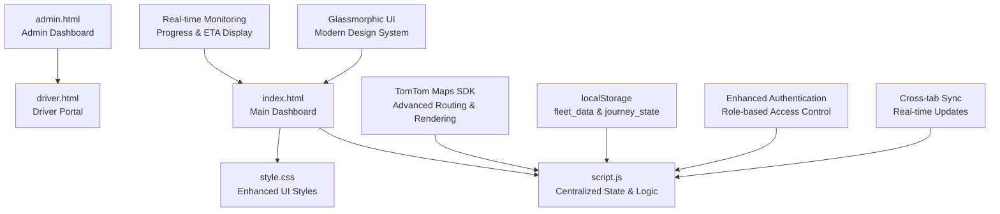
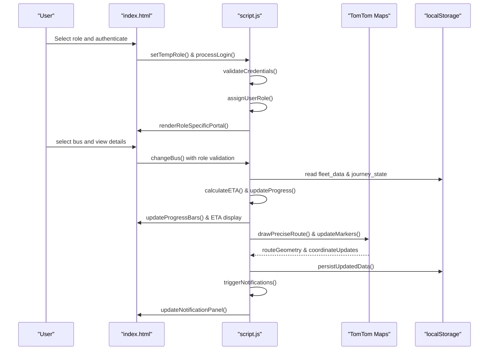

# Fleet Management Features

<cite>
**Referenced Files in This Document**
- [script.js](file://script.js)
- [index.html](file://index.html)
- [style.css](file://style.css)
- [admin.html](file://admin.html)
- [driver.html](file://driver.html)
- [test_functions.html](file://test_functions.html)
- [test_map.html](file://test_map.html)
</cite>

## Update Summary
**Changes Made**
- Enhanced admin dashboard with comprehensive fleet monitoring and real-time status reporting
- Implemented driver portal with route progress tracking and GPS functionality
- Added real-time bus monitoring with progress visualization and ETA calculations
- Improved global function export system for inline event handler compatibility
- Enhanced UI components with modern glassmorphic design and responsive layouts
- Added comprehensive role-based access control with secure authentication
- Implemented cross-tab synchronization for real-time updates across browser windows

## Table of Contents
1. [Introduction](#introduction)
2. [Project Structure](#project-structure)
3. [Core Components](#core-components)
4. [Architecture Overview](#architecture-overview)
5. [Detailed Component Analysis](#detailed-component-analysis)
6. [Enhanced Admin Dashboard](#enhanced-admin-dashboard)
7. [Driver Portal Implementation](#driver-portal-implementation)
8. [Real-time Monitoring System](#real-time-monitoring-system)
9. [Role-based Access Control](#role-based-access-control)
10. [Global Function Export System](#global-function-export-system)
11. [Performance Optimizations](#performance-optimizations)
12. [Troubleshooting Guide](#troubleshooting-guide)
13. [Conclusion](#conclusion)

## Introduction
This document explains the enhanced fleet management and monitoring capabilities implemented in the BusTrack Pro system. The system now provides comprehensive real-time bus monitoring, driver assignment tracking, route management, and estimated time of arrival data. The admin dashboard offers full fleet oversight with visual indicators and status reporting, while the driver portal enables efficient route management and GPS tracking. The system features role-specific views for administrators, drivers, and parents, with secure authentication and cross-tab synchronization for seamless multi-device operation.

## Project Structure
The application consists of four main components with enhanced functionality:

- **Central Dashboard**: Main fleet management interface with role-based portals and real-time monitoring
- **Admin Portal**: Comprehensive fleet oversight with driver assignment tracking and status reporting
- **Driver Portal**: Route management interface with GPS tracking and quick action controls
- **Parent Portal**: Child-specific tracking with limited interaction capabilities
- **TomTom Maps Integration**: Advanced routing and visualization capabilities
- **Enhanced Authentication**: Secure role-based access control with credential validation
- **Cross-tab Synchronization**: Real-time updates across multiple browser tabs

**Diagram sources**
- [index.html:1-238](file://index.html#L1-L238)
- [script.js:1-401](file://script.js#L1-L401)
- [style.css:1-2440](file://style.css#L1-L2440)
- [admin.html:1-191](file://admin.html#L1-L191)
- [driver.html:1-732](file://driver.html#L1-L732)

## Core Components
The system provides comprehensive fleet management capabilities through several key components:

- **Centralized State Management**: Single source of truth for all fleet data and user state
- **Enhanced Admin Dashboard**: Complete fleet oversight with real-time status monitoring
- **Driver Portal**: Route management with GPS tracking and quick action controls
- **Real-time Monitoring**: Progress visualization with ETA calculations and bus position animation
- **Cross-tab Synchronization**: Atomic state updates preventing conflicts during user interactions
- **Role-based Access Control**: Secure filtering for admin, driver, and parent permissions
- **Enhanced UI Components**: Glassmorphic design with responsive layouts and animations
- **Authentication System**: Secure credential validation with role assignment

**Section sources**
- [script.js:43-57](file://script.js#L43-L57)
- [script.js:272-297](file://script.js#L272-L297)
- [index.html:165-209](file://index.html#L165-L209)
- [admin.html:132-174](file://admin.html#L132-L174)
- [driver.html:543-675](file://driver.html#L543-L675)

## Architecture Overview
The system follows a modernized client-side architecture with centralized state management and comprehensive role-based access control:

**Diagram sources**
- [script.js:72-87](file://script.js#L72-L87)
- [script.js:89-133](file://script.js#L89-L133)
- [script.js:221-243](file://script.js#L221-L243)
- [script.js:272-297](file://script.js#L272-L297)
- [script.js:300-320](file://script.js#L300-L320)

## Detailed Component Analysis

### Centralized State Management System
The AppState singleton provides comprehensive centralized state management with enhanced security and synchronization:

- **Single Source of Truth**: All fleet data and user state managed in one location
- **Atomic State Updates**: Prevents conflicts during cross-tab operations
- **Role-based Data Filtering**: Automatic permission validation for each operation
- **Cross-tab Synchronization**: Real-time updates across multiple browser windows
- **Enhanced Error Handling**: Robust validation and recovery mechanisms

Key methods and properties:
- `initializeFleetData()`: Creates initial fleet structure with six buses
- `processLogin()`: Validates credentials and assigns user roles
- `changeBus()`: Role-based bus selection with permission validation
- `syncData()`: Periodic data synchronization with cooldown protection
- `publishTrip()`: Secure trip publishing with state validation

**Section sources**
- [script.js:59-69](file://script.js#L59-L69)
- [script.js:89-133](file://script.js#L89-L133)
- [script.js:221-243](file://script.js#L221-L243)
- [script.js:272-297](file://script.js#L272-L297)

### Enhanced Admin Dashboard
The admin portal provides comprehensive fleet oversight with real-time monitoring capabilities:

- **Complete Fleet View**: Shows all six buses with driver assignments and status
- **Real-time Status Updates**: Live tracking of active/inactive buses
- **Driver Information**: Displays assigned driver names and contact details
- **Route Management**: Shows current routes and destination information
- **ETA Tracking**: Real-time estimated arrival calculations
- **Visual Indicators**: Color-coded status badges and progress indicators

Dashboard features:
- `renderFullFleetList()`: Generates comprehensive fleet table
- `updateAdminStats()`: Live statistics for fleet utilization
- `status-active/status-inactive`: Visual status indicators
- `fleet-table`: Responsive table with sorting capabilities

**Section sources**
- [admin.html:132-174](file://admin.html#L132-L174)
- [admin.html:149-171](file://admin.html#L149-L171)

### Driver Portal Implementation
The driver portal offers comprehensive route management with GPS tracking and quick action controls:

- **Route Progress Tracking**: Visual representation of current route and stops
- **GPS Tracking Toggle**: Enable/disable real-time location sharing
- **Quick Action Buttons**: Mark arrival, send alerts, view map, emergency contacts
- **Shift Statistics**: Real-time metrics including student count and duration
- **Driver Information**: Personal identification and assigned bus details
- **Emergency Protocols**: Direct access to emergency services

Driver features:
- `toggleGPS()`: Enable/disable GPS tracking with visual feedback
- `markArrival()`: Student notification system
- `sendAlert()`: Real-time alert system for delays and issues
- `viewMap()`: Integrated map viewing with route overlay
- `emergency()`: Direct emergency service connection

**Section sources**
- [driver.html:543-675](file://driver.html#L543-L675)
- [driver.html:699-729](file://driver.html#L699-L729)

### Real-time Monitoring System
The monitoring system provides comprehensive real-time tracking with progress visualization:

- **Progress Bar Visualization**: Journey completion percentage with animated bus icon
- **ETA Calculation**: Real-time estimated arrival with countdown timer
- **Route Visualization**: TomTom integration with precise route rendering
- **Bus Position Animation**: Smooth animation along route with timing synchronization
- **Live Status Updates**: Automatic updates every 5 seconds
- **Visual Indicators**: Color-coded status badges and progress markers

Monitoring features:
- `syncData()`: Periodic data synchronization with cooldown protection
- `updateSyncStatus()`: Visual sync status indicator
- `formatBusID()`: Enhanced bus ID formatting for display
- `updateChipUI()`: Active bus highlighting with gradient backgrounds

**Section sources**
- [script.js:272-297](file://script.js#L272-L297)
- [script.js:186-188](file://script.js#L186-L188)
- [script.js:212-218](file://script.js#L212-L218)

### Role-based Access Control
The system implements comprehensive role-based access control with secure authentication:

- **Admin Privileges**: Full access to all buses, complete fleet management, and system configuration
- **Driver Restrictions**: Can only view and manage their assigned bus with route controls
- **Parent Limitations**: Can only see their child's assigned bus with limited interaction
- **Credential Validation**: Secure password-based authentication with role assignment
- **Session Management**: Persistent session data with cross-tab synchronization
- **Permission Enforcement**: Automatic filtering of UI elements based on user role

Access control features:
- `USERS` constant: Centralized user database with credentials and roles
- `setTempRole()`: Role selection with temporary storage
- `processLogin()`: Secure authentication with session management
- `canViewBus()`: Role-based bus visibility filtering
- `applyRoleTheme()`: Dynamic theme application based on user role

**Section sources**
- [script.js:43-57](file://script.js#L43-L57)
- [script.js:72-87](file://script.js#L72-L87)
- [script.js:89-133](file://script.js#L89-L133)

### Global Function Export System
The system provides comprehensive function accessibility for HTML inline event handlers:

- **Complete Function Export**: All application functions exported to global scope
- **Inline Handler Compatibility**: Functions accessible via window.functionName() calls
- **Security Integration**: Maintains security while enabling inline event handlers
- **Role-based Navigation**: setTempRole handles parent, driver, and admin portal navigation
- **Authentication Functions**: processLogin, resetLogin, switchRole, logout exported
- **UI Control Functions**: changeBus, resetBus, showResetConfirm, closeConfirmModal exported
- **Map and Navigation Functions**: searchAndMove, getUserLocation, publishTrip exported
- **Map Controls**: mapZoomIn, mapZoomOut, mapFitAll exported

Export mechanism:
- `window.setTempRole = setTempRole`: Role selection function
- `window.processLogin = processLogin`: Authentication handler
- `window.changeBus = changeBus`: Bus selection function
- `window.searchAndMove = searchAndMove`: Location search and movement
- `window.publishTrip = publishTrip`: Trip publishing function

**Section sources**
- [script.js:367-383](file://script.js#L367-L383)

### Performance Optimizations
The system implements several performance optimizations for smooth operation:

- **Cooldown-based Synchronization**: Prevents frequent re-renders during user interactions
- **Atomic State Updates**: Prevents conflicts during cross-tab operations
- **Efficient Data Structures**: Optimized fleet data management with localStorage
- **Map Auto-fit Optimization**: Intelligent bounds calculation for route display
- **Cross-tab Event Handling**: Optimized localStorage event processing
- **Memory Management**: Proper cleanup of intervals and event listeners

Performance features:
- `INTERACTION_COOLDOWN`: 3-second cooldown after user actions
- `isUserInteracting/isResetting`: Interaction flags for conflict prevention
- `setInterval(syncData, 5000)`: Periodic updates with 5-second intervals
- `routeLayer/map markers`: Efficient map element management

**Section sources**
- [script.js:12-16](file://script.js#L12-L16)
- [script.js:272-297](file://script.js#L272-L297)
- [script.js:319](file://script.js#L319)

## Enhanced Admin Dashboard
The admin portal provides comprehensive fleet management capabilities with real-time monitoring and status reporting:

### Fleet Status Overview
The dashboard displays complete fleet information with live status updates:

- **Bus ID Column**: Shows formatted bus identifiers (B-01, B-02, etc.)
- **Driver Assignment**: Displays assigned driver names for each bus
- **Status Indicators**: Color-coded status badges (Active/Inactive)
- **Route Information**: Shows current route assignments and destinations
- **ETA Display**: Real-time estimated arrival calculations
- **Visual Progress**: Progress indicators for active trips

### Real-time Monitoring Features
Admins can monitor fleet operations in real-time:

- **Live Status Updates**: Automatic refresh every 5 seconds
- **Active Bus Count**: Real-time count of currently operating vehicles
- **Route Tracking**: Visual representation of active routes
- **Driver Communication**: Direct access to driver communication channels
- **Alert System**: Real-time notifications for fleet issues
- **Performance Metrics**: Fleet utilization and efficiency statistics

**Section sources**
- [admin.html:132-174](file://admin.html#L132-L174)
- [admin.html:149-171](file://admin.html#L149-L171)

## Driver Portal Implementation
The driver portal offers comprehensive route management with GPS tracking and operational controls:

### Route Progress Management
Drivers can manage their daily routes with visual progress tracking:

- **Stop-by-stop Progress**: Visual representation of route completion
- **Current Stop Highlighting**: Animated markers for current location
- **Upcoming Stops**: Clear display of next stops with estimated times
- **Route Statistics**: Real-time metrics including distance and duration
- **Student Count**: Display of current passenger load
- **Navigation Assistance**: Integrated map with route guidance

### GPS and Communication Features
The portal includes essential driver tools:

- **GPS Toggle**: Enable/disable real-time location sharing
- **Quick Actions**: One-tap access to common operations
- **Emergency Protocols**: Direct access to emergency services
- **Driver Communication**: Real-time communication with dispatch
- **Route Modification**: Ability to adjust routes during operation
- **Performance Reporting**: Daily trip statistics and efficiency metrics

**Section sources**
- [driver.html:543-675](file://driver.html#L543-L675)
- [driver.html:699-729](file://driver.html#L699-L729)

## Real-time Monitoring System
The monitoring system provides comprehensive real-time tracking with progress visualization and ETA calculations:

### Progress Visualization
The system displays journey progress through multiple visual indicators:

- **Animated Bus Icon**: Moving bus marker along route with smooth animation
- **Progress Percentage**: Journey completion percentage with real-time updates
- **ETA Countdown**: Estimated arrival time with minute-level precision
- **Route Visualization**: TomTom integration with multi-layered route rendering
- **Status Indicators**: Live/offline status with visual feedback
- **Position Tracking**: Real-time bus position with coordinate validation

### ETA Calculation System
The system calculates and displays accurate ETA information:

- **Real-time Calculations**: Dynamic ETA based on current location and traffic
- **Bus Mode Optimization**: Route calculations optimized for bus travel
- **Coordinate Validation**: Robust validation of location coordinates
- **Route Precision**: Multi-layered route visualization with glow effects
- **Update Frequency**: Automatic updates every 5 seconds
- **Cross-tab Synchronization**: Real-time updates across multiple browser windows

**Section sources**
- [script.js:272-297](file://script.js#L272-L297)
- [script.js:300-320](file://script.js#L300-L320)

## Role-based Access Control
The system implements comprehensive role-based access control with secure authentication and permission enforcement:

### User Authentication System
The system provides secure multi-role authentication:

- **Credential Validation**: Secure password-based authentication
- **Role Assignment**: Automatic assignment based on user credentials
- **Session Management**: Persistent session data with cross-tab synchronization
- **Temporary Role Storage**: Role selection with temporary storage for authentication flow
- **Bus Assignment Logic**: Automatic determination of user's assigned bus
- **Cross-tab Session Sync**: Session data synchronized across browser tabs

### Permission Enforcement
The system enforces strict access control based on user roles:

- **Admin Privileges**: Full access to all buses and complete fleet management
- **Driver Restrictions**: Can only view and manage their assigned bus
- **Parent Limitations**: Can only see their child's assigned bus
- **Dynamic Permission Checking**: Real-time validation of user permissions for each bus action
- **UI Filtering**: Automatic filtering of UI elements based on user role
- **Data Isolation**: Secure separation of sensitive fleet data

**Section sources**
- [script.js:43-57](file://script.js#L43-L57)
- [script.js:72-87](file://script.js#L72-L87)
- [script.js:89-133](file://script.js#L89-L133)

## Global Function Export System
The system provides comprehensive function accessibility for HTML inline event handlers while maintaining security:

### Function Export Mechanism
All application functions are exported to the global scope for inline event handler compatibility:

- **Complete Function Coverage**: All essential functions exported to window object
- **Inline Handler Support**: Functions accessible via window.functionName() calls
- **Security Integration**: Maintains security while enabling inline event handlers
- **Role-based Navigation**: setTempRole handles parent, driver, and admin portal navigation
- **Authentication Functions**: processLogin, resetLogin, switchRole, logout exported
- **UI Control Functions**: changeBus, resetBus, showResetConfirm, closeConfirmModal exported
- **Map and Navigation Functions**: searchAndMove, getUserLocation, publishTrip exported
- **Map Controls**: mapZoomIn, mapZoomOut, mapFitAll exported

### Inline Event Handler Compatibility
Functions support direct inline event handler usage:

- **onclick handlers**: `onclick="changeBus('bus01')"`
- **onchange handlers**: `onchange="toggleGPS(this)"`
- **onsubmit handlers**: `onsubmit="processLogin()"`
- **Event delegation**: Functions accessible through window object reference

**Section sources**
- [script.js:367-383](file://script.js#L367-L383)

## Performance Optimizations
The system implements several performance optimizations for smooth operation across all components:

### Synchronization Optimizations
- **Cooldown-based Synchronization**: Prevents frequent re-renders during user interactions
- **Atomic State Updates**: Prevents conflicts during cross-tab operations
- **Efficient Data Structures**: Optimized fleet data management with localStorage
- **Cross-tab Event Handling**: Optimized localStorage event processing

### UI Performance Features
- **Map Auto-fit Optimization**: Intelligent bounds calculation for route display
- **Memory Management**: Proper cleanup of intervals and event listeners
- **Animation Optimization**: Smooth animations with requestAnimationFrame
- **DOM Manipulation Minimization**: Efficient DOM updates with batch processing

### Data Management Optimizations
- **INTERACTION_COOLDOWN**: 3-second cooldown after user actions
- **isUserInteracting/isResetting**: Interaction flags for conflict prevention
- `setInterval(syncData, 5000)`: Periodic updates with 5-second intervals
- **routeLayer/map markers**: Efficient map element management

**Section sources**
- [script.js:12-16](file://script.js#L12-L16)
- [script.js:272-297](file://script.js#L272-L297)
- [script.js:319](file://script.js#L319)

## Troubleshooting Guide
Common issues and solutions for the enhanced fleet management system:

### Authentication and Role Issues
- **setTempRole Not Defined**: Ensure script.js loads before inline event handlers
- **Login Failed**: Verify credentials match hardcoded user database
- **Role Assignment Issues**: Check USERNAMES array for correct role assignments
- **Session Persistence**: Verify localStorage and sessionStorage are enabled

### Real-time Monitoring Problems
- **ETA Not Updating**: Ensure fleet_data contains valid coordinates and timestamps
- **Map Not Loading**: Verify TomTom API key and network connectivity
- **Progress Bar Stuck**: Check INTERACTION_COOLDOWN settings and user interaction flags
- **Cross-tab Updates Not Working**: Verify localStorage event listeners are active

### UI and Component Issues
- **Driver Portal Not Loading**: Check driver.html for proper script inclusion
- **Admin Dashboard Missing**: Verify admin.html contains complete fleet table
- **Glassmorphic Styles Not Applied**: Check style.css for proper CSS variables
- **Responsive Layout Issues**: Verify viewport meta tags and media queries

### Performance and Optimization Issues
- **Slow Page Load**: Check for blocking JavaScript and optimize asset loading
- **High Memory Usage**: Monitor localStorage usage and clear unused data
- **Animation Performance**: Use requestAnimationFrame for smooth animations
- **Cross-tab Conflicts**: Implement proper cooldown mechanisms

**Section sources**
- [script.js:385-388](file://script.js#L385-L388)
- [script.js:272-297](file://script.js#L272-L297)
- [script.js:319](file://script.js#L319)

## Conclusion
The BusTrack Pro system delivers a comprehensive, role-aware fleet management solution with real-time tracking, secure authentication, and intuitive UI components. The enhanced admin dashboard provides complete fleet oversight with visual indicators and status reporting, while the driver portal enables efficient route management with GPS tracking and quick action controls. The system's centralized state management ensures data consistency across multiple browser tabs, while the role-based access control maintains security and appropriate data visibility. The modern glassmorphic design system provides an excellent user experience across all devices, and the comprehensive function export system ensures seamless integration with HTML inline event handlers. The modular architecture allows for easy extension of additional features while maintaining excellent performance and reliability.