# Map Integration and Routing

<cite>
**Referenced Files in This Document**
- [script.js](file://script.js)
- [index.html](file://index.html)
- [style.css](file://style.css)
- [admin.html](file://admin.html)
- [driver.html](file://driver.html)
- [test_map.html](file://test_map.html)
</cite>

## Update Summary
**Changes Made**
- Added new map overlay controls (zoom, route fitting) with smooth animations
- Implemented resizable sidebar functionality with drag handles and responsive constraints
- Enhanced coordinate loading from localStorage with comprehensive error handling and validation
- Added interactive legend elements for map visualization
- Updated UI integration to support new map controls and sidebar resizing

## Table of Contents
1. [Introduction](#introduction)
2. [Project Structure](#project-structure)
3. [Core Components](#core-components)
4. [Architecture Overview](#architecture-overview)
5. [Detailed Component Analysis](#detailed-component-analysis)
6. [Dependency Analysis](#dependency-analysis)
7. [Performance Considerations](#performance-considerations)
8. [Troubleshooting Guide](#troubleshooting-guide)
9. [Conclusion](#conclusion)

## Introduction
This document explains the TomTom Maps SDK integration and routing functionality for the BusTrack MB Pro system. It covers interactive mapping with custom marker styling, route calculation and visualization, coordinate system usage, known location database, fuzzy search and location matching, fallback to TomTom APIs, traffic-aware routing, multi-layered route visualization with glow effects, custom styling, auto-zoom capabilities, ETA calculation logic, real-time route updates, supported location queries, and troubleshooting common mapping issues.

**Updated** Added new map overlay controls (zoom, route fitting), interactive legend elements, resizable sidebar functionality with drag handles, and enhanced coordinate loading from localStorage with improved error handling.

## Project Structure
The project consists of a single-page application with a dashboard that integrates TomTom Maps and Services, plus auxiliary pages for administration and driver portal. The main runtime logic resides in a single JavaScript file that orchestrates authentication, map initialization, search, routing, and UI updates.

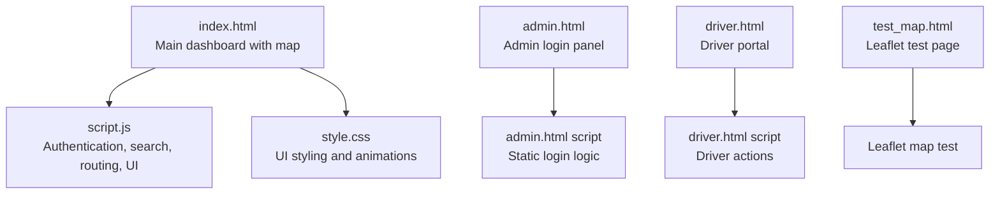

**Diagram sources**
- [index.html:1-238](file://index.html#L1-L238)
- [script.js:1-2146](file://script.js#L1-L2146)
- [style.css:1-2440](file://style.css#L1-L2440)
- [admin.html:1-34](file://admin.html#L1-L34)
- [driver.html:1-732](file://driver.html#L1-L732)
- [test_map.html:1-51](file://test_map.html#L1-L51)

**Section sources**
- [index.html:1-238](file://index.html#L1-L238)
- [script.js:1-2146](file://script.js#L1-L2146)
- [style.css:1-2440](file://style.css#L1-L2440)
- [admin.html:1-34](file://admin.html#L1-L34)
- [driver.html:1-732](file://driver.html#L1-L732)
- [test_map.html:1-51](file://test_map.html#L1-L51)

## Core Components
- Authentication and role-based access control with client-side credentials
- TomTom Maps SDK initialization and map lifecycle
- TomTom Search API fuzzy search with known location database
- TomTom Routing API for bus routes with traffic-aware optimization
- Multi-layered route visualization with glow, inner highlight, and smooth auto-zoom
- ETA calculation and progress visualization
- Local storage-backed fleet data persistence
- Toast notifications and modal confirmations
- **New** Map overlay controls (zoom in/out, fit route) with smooth animations
- **New** Resizable sidebar with drag handles and responsive constraints
- **New** Interactive legend elements for map visualization
- **Enhanced** Coordinate loading with comprehensive validation and error handling

**Section sources**
- [script.js:37-152](file://script.js#L37-L152)
- [script.js:274-367](file://script.js#L274-L367)
- [script.js:540-584](file://script.js#L540-L584)
- [script.js:1742-1806](file://script.js#L1742-L1806)
- [script.js:207-578](file://script.js#L207-L578)
- [script.js:580-719](file://script.js#L580-L719)
- [script.js:887-938](file://script.js#L887-L938)

## Architecture Overview
The system follows a modular client-side architecture:
- HTML pages define UI shells and containers
- CSS provides styling and animations
- JavaScript handles all logic: authentication, map lifecycle, search, routing, UI updates, and persistence

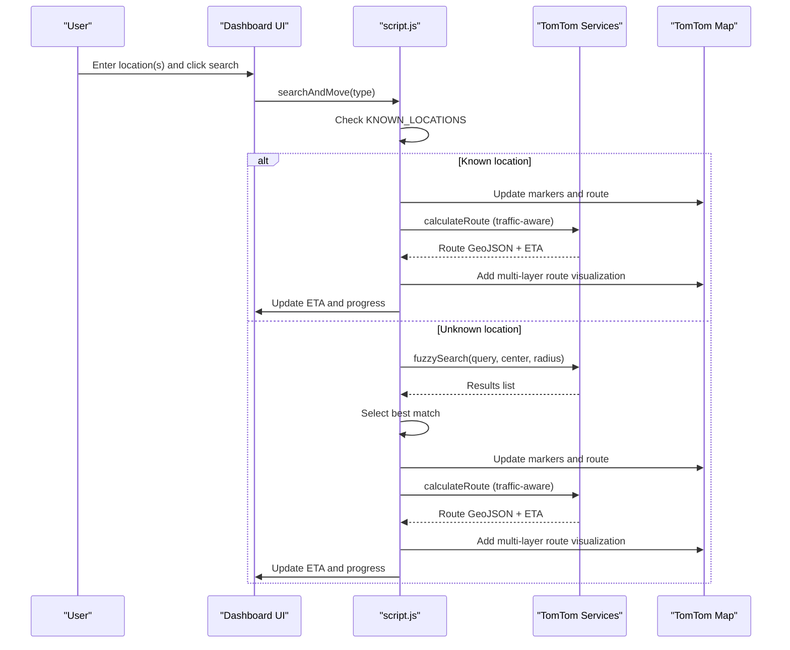

**Diagram sources**
- [script.js:633-769](file://script.js#L633-L769)
- [script.js:866-1060](file://script.js#L866-L1060)

## Detailed Component Analysis

### Authentication and Role Management
- Hardcoded client-side users with roles and bus assignments
- Session and local storage management for roles and active user
- Role-based rendering of fleet lists and UI elements
- Launch dashboard after successful login

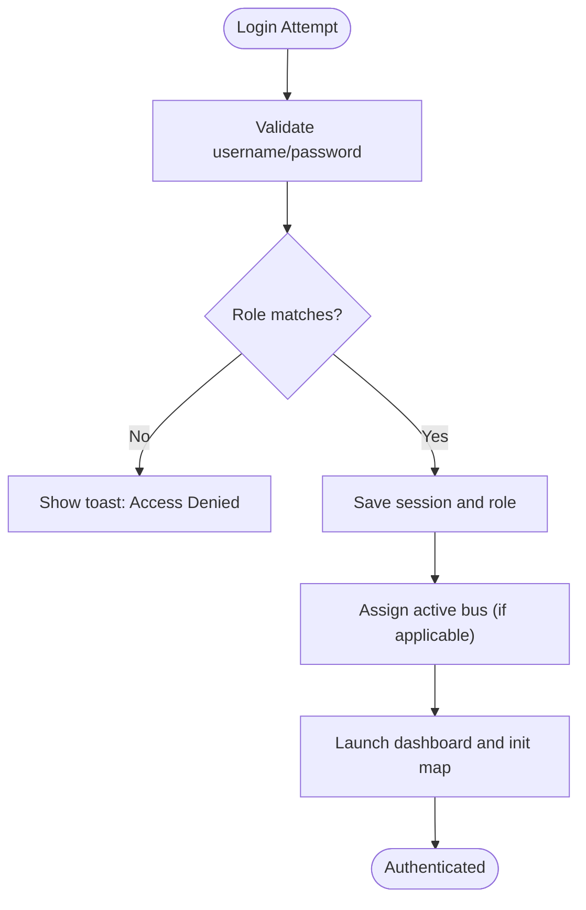

**Diagram sources**
- [script.js:439-469](file://script.js#L439-L469)
- [script.js:586-598](file://script.js#L586-L598)

**Section sources**
- [script.js:37-152](file://script.js#L37-L152)

### Map Initialization and Lifecycle
- Initializes TomTom map with center and zoom
- Resizes map on load and sets up periodic sync
- Provides publish trip and logout utilities

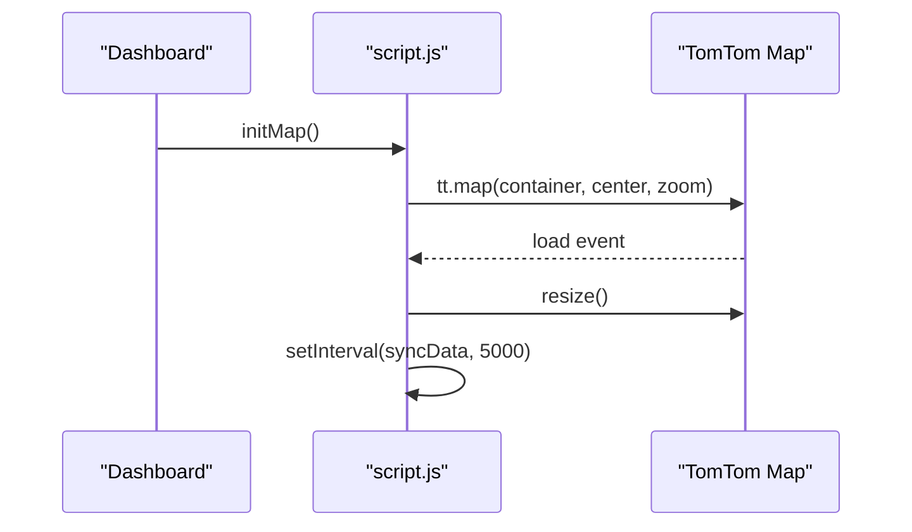

**Diagram sources**
- [script.js:887](file://script.js#L887)

**Section sources**
- [script.js:887](file://script.js#L887)

### Known Location Database and Coordinate System
- Exact coordinates for Shree L.R. Tiwari College of Engineering and Mira Road Railway Station
- Normalized fuzzy keys for robust matching
- Coordinates stored as latitude/longitude pairs

Supported exact locations:
- Shree L.R. Tiwari College of Engineering (latitude: 19.282, longitude: 72.855)
- Mira Road Railway Station (latitude: 19.281, longitude: 72.855)

Coordinate system usage:
- TomTom SDK expects [longitude, latitude] order for positions
- Internal state stores {lat, lng, name}

**Section sources**
- [script.js:614-631](file://script.js#L614-L631)

### Fuzzy Search and Location Matching
- Uses TomTom fuzzySearch with center and radius around Mira-Bhayandar area
- Limits results and filters by country and language
- Implements a scoring algorithm to select the best match from multiple results
- Falls back to known locations when exact matches are found

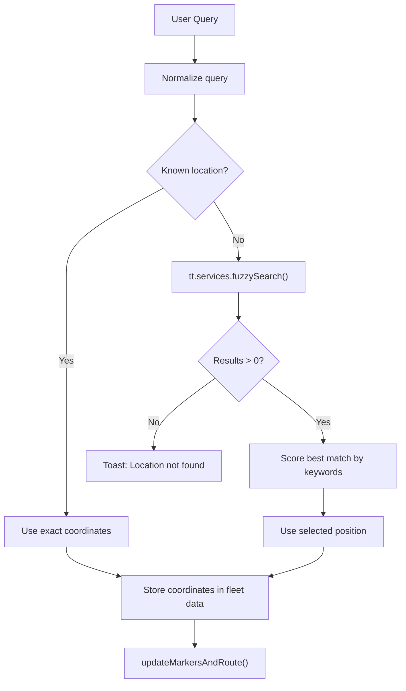

**Diagram sources**
- [script.js:633-769](file://script.js#L633-L769)

**Section sources**
- [script.js:633-769](file://script.js#L633-L769)

### Route Calculation and Traffic-Aware Optimization
- Uses TomTom Routing API with bus travel mode and fastest route type
- Enables traffic-aware routing
- Calculates ETA from route summary
- Stores ETA per bus in local storage

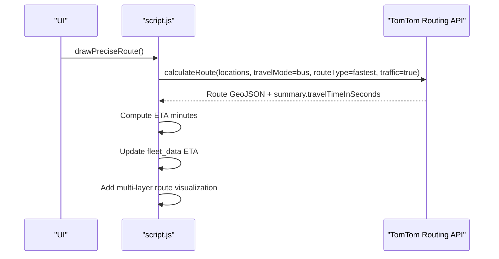

**Diagram sources**
- [script.js:866-1060](file://script.js#L866-L1060)

**Section sources**
- [script.js:866-1060](file://script.js#L866-L1060)

### Multi-Layered Route Visualization and Custom Styling
- Adds a glow layer beneath the main route
- Adds an inner highlight layer for depth
- Uses smooth easing and auto-zoom to fit both markers and route geometry
- Applies custom marker styling with blue for start and red for destination

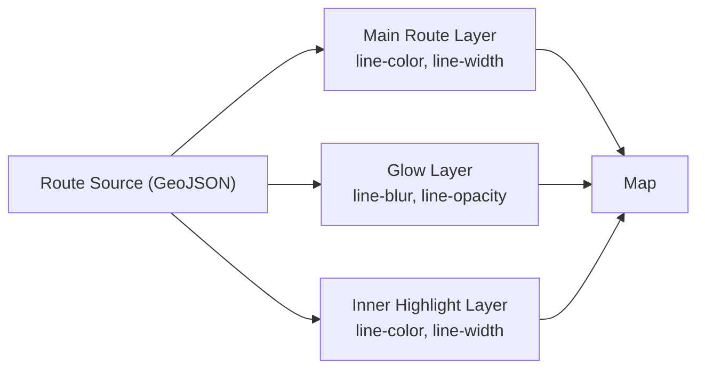

**Diagram sources**
- [script.js:987-1024](file://script.js#L987-L1024)

**Section sources**
- [script.js:865-1060](file://script.js#L865-L1060)

### Map Overlay Controls and Interactive Features
- **New** Zoom controls with smooth animations (zoom in/out buttons)
- **New** Route fitting functionality to auto-fit markers and route geometry
- **New** Interactive legend elements for map visualization
- **New** Enhanced coordinate loading with validation and error handling

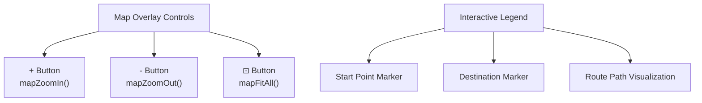

**Diagram sources**
- [script.js:1742-1806](file://script.js#L1742-L1806)
- [index.html:212-233](file://index.html#L212-L233)

**Section sources**
- [script.js:1742-1806](file://script.js#L1742-L1806)
- [index.html:212-233](file://index.html#L212-L233)

### Resizable Sidebar Functionality
- **New** Drag handle implementation for sidebar resizing
- **New** Responsive width constraints (220px - 400px)
- **New** Smooth resizing with visual feedback
- **New** Automatic map resize during and after dragging

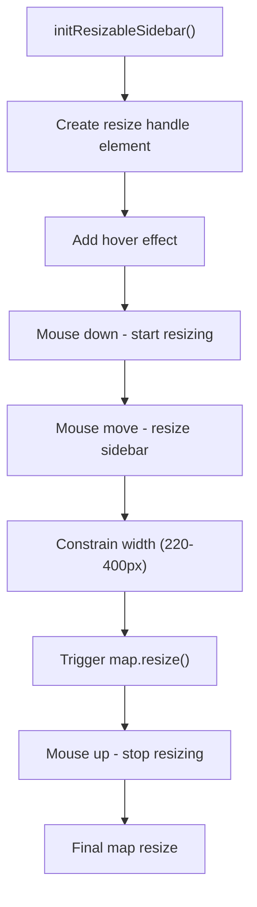

**Diagram sources**
- [script.js:274-367](file://script.js#L274-L367)

**Section sources**
- [script.js:274-367](file://script.js#L274-L367)

### Enhanced Coordinate Loading from localStorage
- **Enhanced** Comprehensive validation for start and end coordinates
- **Enhanced** Error handling for invalid or missing coordinate data
- **Enhanced** Graceful degradation when coordinates are invalid
- **Enhanced** Improved logging and debugging information

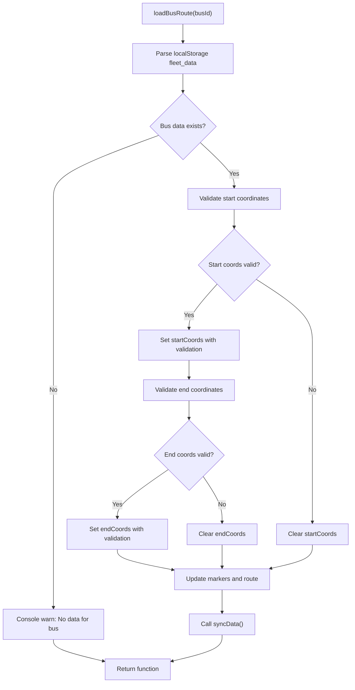

**Diagram sources**
- [script.js:540-584](file://script.js#L540-L584)

**Section sources**
- [script.js:540-584](file://script.js#L540-L584)

### ETA Calculation Logic and Real-Time Updates
- Computes ETA in minutes from route summary
- Updates UI progress bar and bus icon position
- Periodic sync updates UI even when not actively changing
- Per-bus ETA stored independently

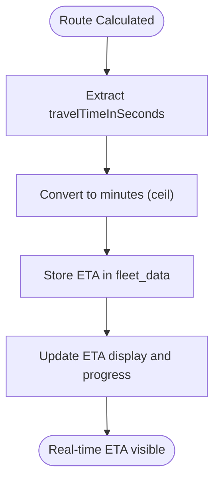

**Diagram sources**
- [script.js:963-973](file://script.js#L963-L973)
- [script.js:1071-1140](file://script.js#L1071-L1140)

**Section sources**
- [script.js:963-973](file://script.js#L963-L973)
- [script.js:1071-1140](file://script.js#L1071-L1140)

### UI Integration and Interaction Controls
- Fleet list chips with active state styling
- Driver and monitor portals with role-specific views
- Toast notifications for feedback
- Reset confirmation modal for clearing bus data
- Auto-sync status indicator with pulsing animation
- **New** Map overlay controls with glassmorphism styling
- **New** Interactive legend with visual indicators

**Section sources**
- [script.js:154-205](file://script.js#L154-L205)
- [script.js:1071-1140](file://script.js#L1071-L1140)
- [script.js:739-770](file://script.js#L739-L770)
- [style.css:1702-1784](file://style.css#L1702-L1784)
- [style.css:1737-1784](file://style.css#L1737-L1784)

## Dependency Analysis
- TomTom Maps SDK and Services are loaded from CDN in the main HTML
- script.js depends on TomTom global objects (tt.map, tt.services, tt.Marker, tt.LngLatBounds)
- UI elements are manipulated via DOM selectors
- Local storage persists fleet data and user sessions

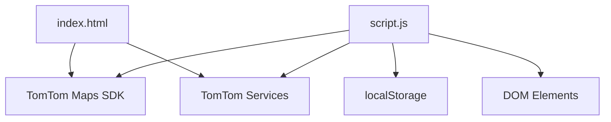

**Diagram sources**
- [index.html:11-13](file://index.html#L11-L13)
- [script.js:1](file://script.js#L1)

**Section sources**
- [index.html:11-13](file://index.html#L11-L13)
- [script.js:1](file://script.js#L1)

## Performance Considerations
- Cooldown mechanism prevents excessive re-rendering during user interactions
- Route layers are removed and re-added to avoid accumulation
- Auto-zoom uses bounds fitting with padding for optimal visibility
- Periodic sync runs at a reasonable interval to balance responsiveness and performance
- **New** Map overlay controls use smooth animations with optimized duration settings
- **New** Resizable sidebar implements efficient constraint checking and minimal DOM manipulation
- **Enhanced** Coordinate loading includes early validation to prevent unnecessary processing

## Troubleshooting Guide
Common mapping issues and resolutions:
- Map not loading: Verify CDN availability and network connectivity; test with the Leaflet test page
- No route found: Ensure both start and destination are valid; check for network errors
- Incorrect locations: Use exact known locations for Shree L.R. Tiwari College of Engineering and Mira Road Railway Station
- ETA not updating: Confirm route calculation succeeded and local storage is accessible
- UI stuck in sync: Check interaction cooldown flags and modal confirmations
- **New** Map controls not responding: Ensure map is initialized before calling zoom/fit functions
- **New** Sidebar not resizing: Check for proper event listener attachment and CSS positioning
- **New** Invalid coordinates error: Verify coordinate values are numeric and within valid ranges

Supporting evidence:
- Network error handling in route calculation
- Toast notifications for user feedback
- Reset confirmation modal to clear stale data
- **Enhanced** Coordinate validation and error messages
- **New** Map control error handling and logging

**Section sources**
- [script.js:1742-1806](file://script.js#L1742-L1806)
- [script.js:274-367](file://script.js#L274-L367)
- [script.js:540-584](file://script.js#L540-L584)
- [script.js:914-915](file://script.js#L914-L915)
- [script.js:742-770](file://script.js#L742-L770)

## Conclusion
The BusTrack MB Pro system integrates TomTom Maps and Services to deliver a robust, interactive fleet monitoring solution. It combines a known location database with fuzzy search, traffic-aware routing, and rich visualization to provide accurate ETA and route insights. The modular design, client-side authentication, and persistent data model enable seamless operation across driver and monitor portals.

**Updated** The recent enhancements include new map overlay controls for zoom and route fitting, resizable sidebar functionality with drag handles, interactive legend elements, and significantly improved coordinate loading with comprehensive error handling. These additions enhance user experience while maintaining the system's reliability and performance standards.