# Project Overview

<cite>
**Referenced Files in This Document**
- [index.html](file://index.html)
- [script.js](file://script.js)
- [style.css](file://style.css)
- [admin.html](file://admin.html)
- [driver.html](file://driver.html)
- [test_map.html](file://test_map.html)
</cite>

## Table of Contents
1. [Introduction](#introduction)
2. [Project Structure](#project-structure)
3. [Core Components](#core-components)
4. [Architecture Overview](#architecture-overview)
5. [Detailed Component Analysis](#detailed-component-analysis)
6. [Dependency Analysis](#dependency-analysis)
7. [Performance Considerations](#performance-considerations)
8. [Troubleshooting Guide](#troubleshooting-guide)
9. [Conclusion](#conclusion)

## Introduction

BusTrack MB Pro is a comprehensive real-time bus tracking and route optimization solution designed specifically for school transportation in Mira Bhayandar, India. This modern fleet management system provides a unified platform for administrators, drivers, and parents to monitor and manage school bus operations with precision and reliability.

The system operates as a single-page application (SPA) that leverages cutting-edge technologies including TomTom's mapping and routing APIs, interactive web mapping, and client-side data persistence through browser storage. Its sophisticated glassmorphism UI design creates an immersive user experience while maintaining excellent usability across all device types.

## Project Structure

The BusTrack MB Pro system follows a modular architecture with distinct entry points for different user roles:

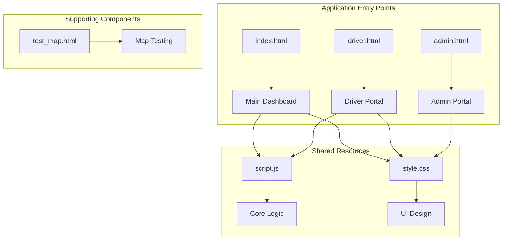

**Diagram sources**
- [index.html:1-141](file://index.html#L1-L141)
- [driver.html:1-732](file://driver.html#L1-L732)
- [admin.html:1-34](file://admin.html#L1-L34)

The system consists of four primary HTML pages, each serving specific user roles:

- **Main Application** (`index.html`): Central dashboard supporting all three user roles with unified navigation
- **Driver Portal** (`driver.html`): Specialized interface for bus operators with route management capabilities
- **Admin Portal** (`admin.html`): Management interface for fleet oversight and system administration
- **Map Testing** (`test_map.html`): Development and testing utility for mapping functionality

**Section sources**
- [index.html:1-141](file://index.html#L1-L141)
- [driver.html:1-732](file://driver.html#L1-L732)
- [admin.html:1-34](file://admin.html#L1-L34)
- [test_map.html:1-51](file://test_map.html#L1-L51)

## Core Components

### Multi-Role Authentication System

The system implements a sophisticated role-based access control mechanism supporting three distinct user types:

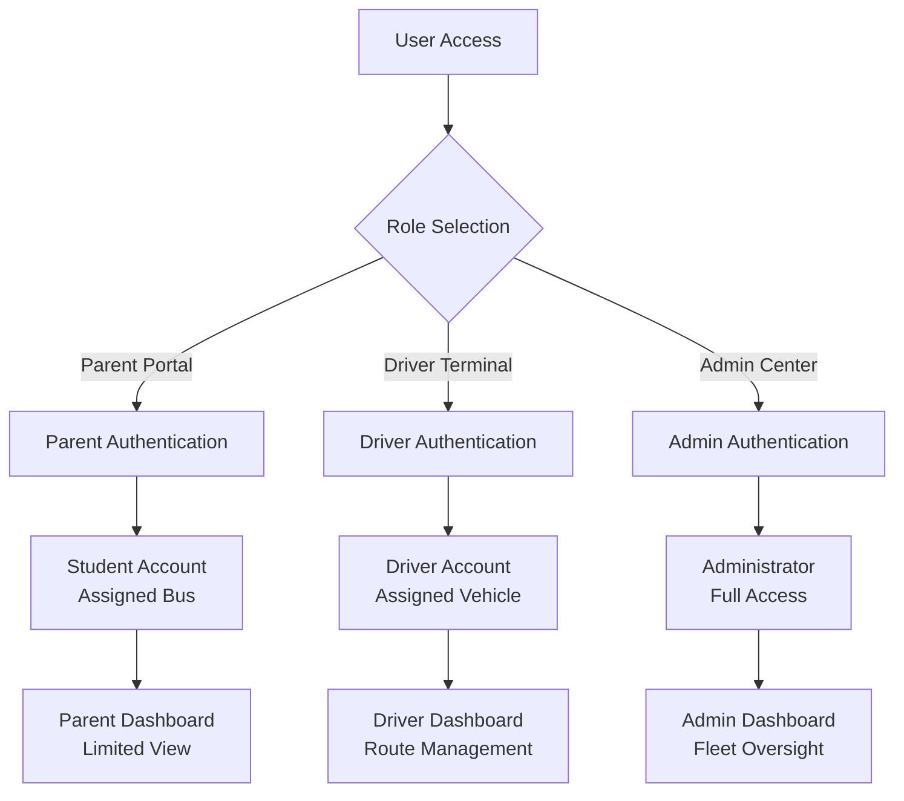

**Diagram sources**
- [script.js:38-55](file://script.js#L38-L55)
- [script.js:70-112](file://script.js#L70-L112)

The authentication system supports:
- **Parent Users**: Student accounts assigned to specific buses with limited visibility
- **Driver Users**: Bus operator accounts with full access to their assigned vehicle
- **Administrator Users**: System-wide access for fleet management oversight

### TomTom API Integration

The system integrates seamlessly with TomTom's comprehensive mapping and routing ecosystem:

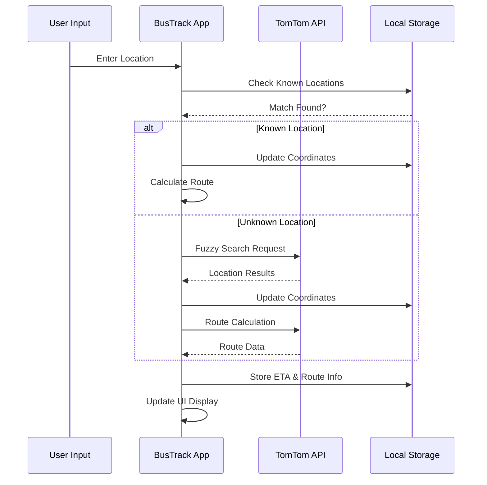

**Diagram sources**
- [script.js:209-364](file://script.js#L209-L364)
- [script.js:447-570](file://script.js#L447-L570)

Key TomTom integrations include:
- **Fuzzy Search**: Intelligent location discovery with multi-result selection
- **Precise Routing**: Bus-specific route calculation with traffic-aware ETA
- **Coordinate Resolution**: Exact latitude/longitude mapping for Mira Bhayandar area

### Interactive Mapping System

The mapping infrastructure provides real-time visualization of bus operations:

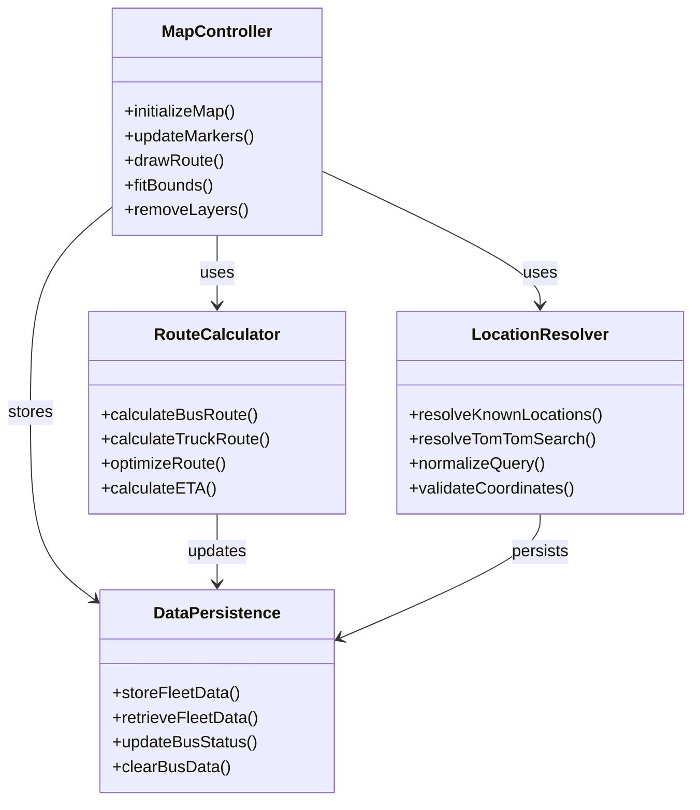

**Diagram sources**
- [script.js:207-570](file://script.js#L207-L570)

### Local Storage-Based Data Persistence

The system implements robust client-side data management:

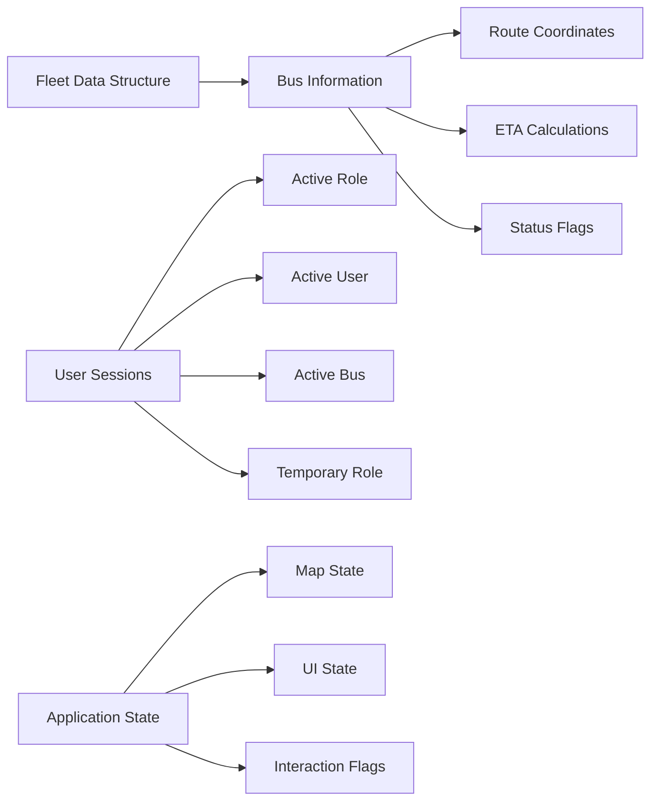

**Diagram sources**
- [script.js:57-67](file://script.js#L57-L67)
- [script.js:581-623](file://script.js#L581-L623)

## Architecture Overview

The BusTrack MB Pro system employs a modern single-page application architecture with clear separation of concerns:

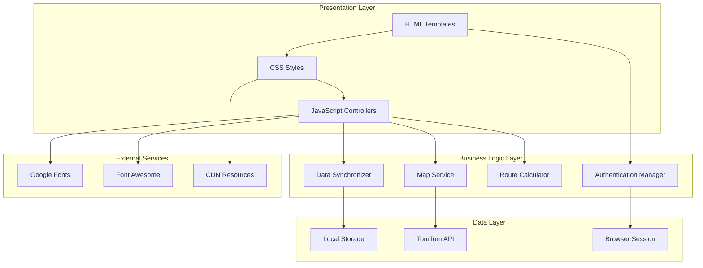

**Diagram sources**
- [index.html:8-12](file://index.html#L8-L12)
- [script.js:1-11](file://script.js#L1-L11)

### Authentication Flow

The authentication process follows a secure, multi-stage verification:

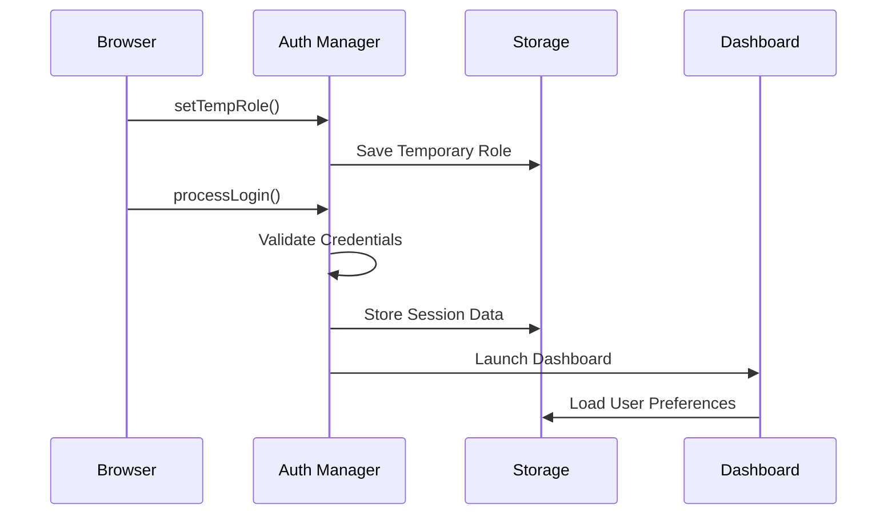

**Diagram sources**
- [script.js:70-152](file://script.js#L70-L152)

### Data Flow Architecture

The system maintains real-time synchronization between user actions and persistent storage:

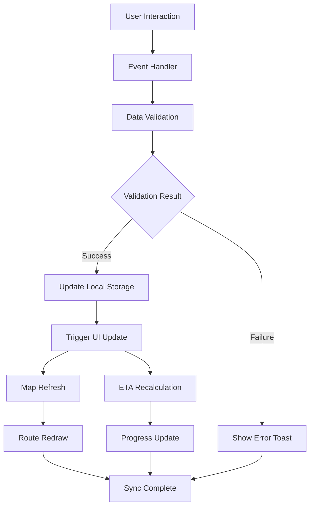

**Diagram sources**
- [script.js:581-623](file://script.js#L581-L623)
- [script.js:887-903](file://script.js#L887-L903)

## Detailed Component Analysis

### Main Dashboard Implementation

The central dashboard serves as the primary interface for all user roles, featuring a responsive layout with role-appropriate functionality:

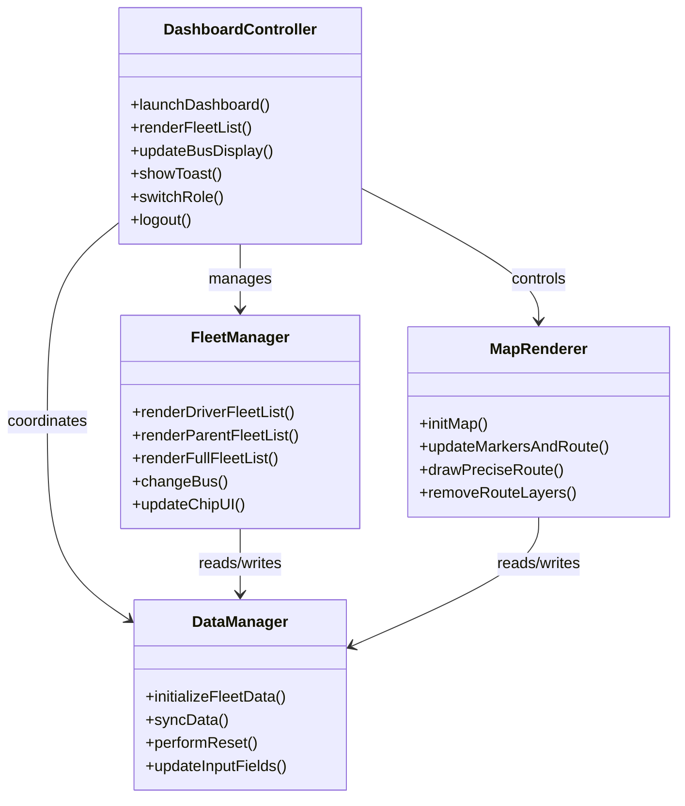

**Diagram sources**
- [script.js:119-152](file://script.js#L119-L152)
- [script.js:154-205](file://script.js#L154-L205)
- [script.js:366-444](file://script.js#L366-L444)

### Driver Portal Features

The driver-specific interface provides comprehensive route management capabilities:

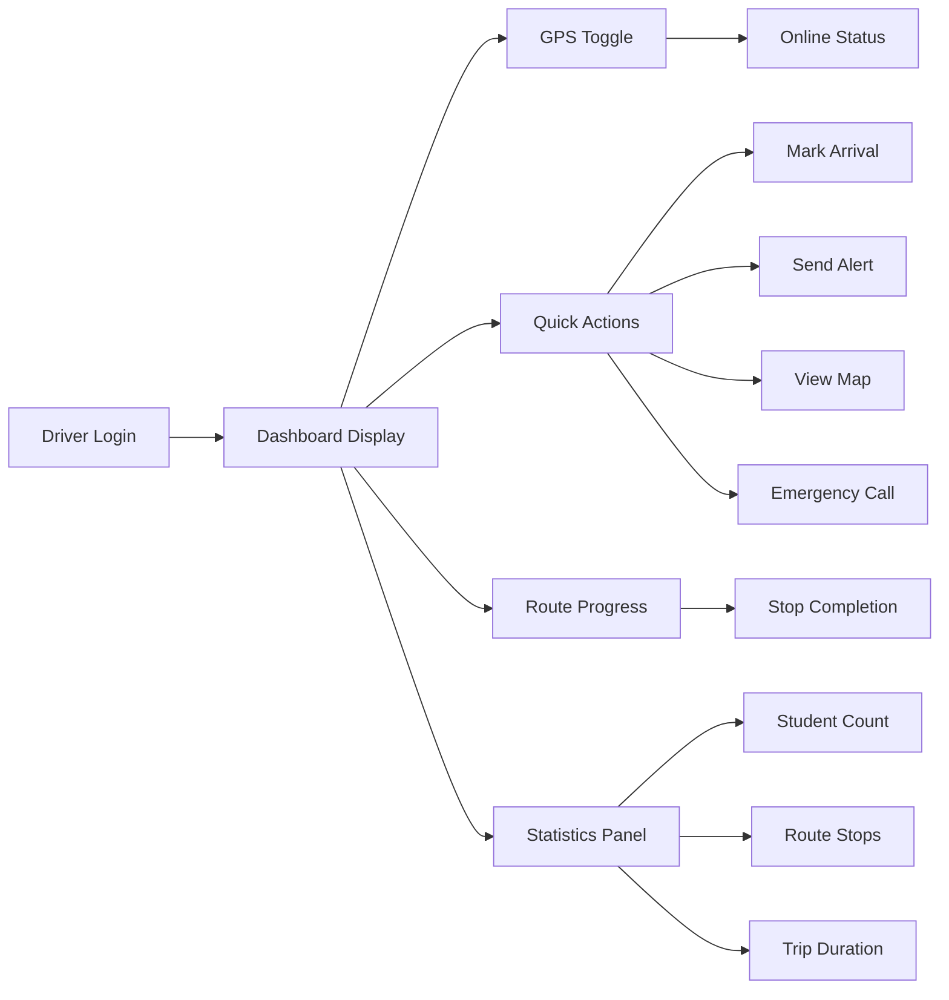

**Diagram sources**
- [driver.html:517-675](file://driver.html#L517-L675)

### Admin Portal Functionality

The administrative interface provides fleet oversight and system management:

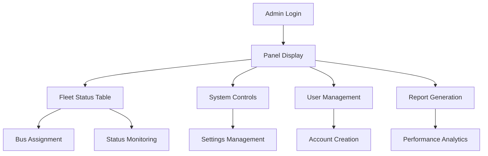

**Diagram sources**
- [admin.html:9-32](file://admin.html#L9-L32)

### Glassmorphism UI Design System

The system implements a sophisticated glassmorphism design language with modern visual elements:

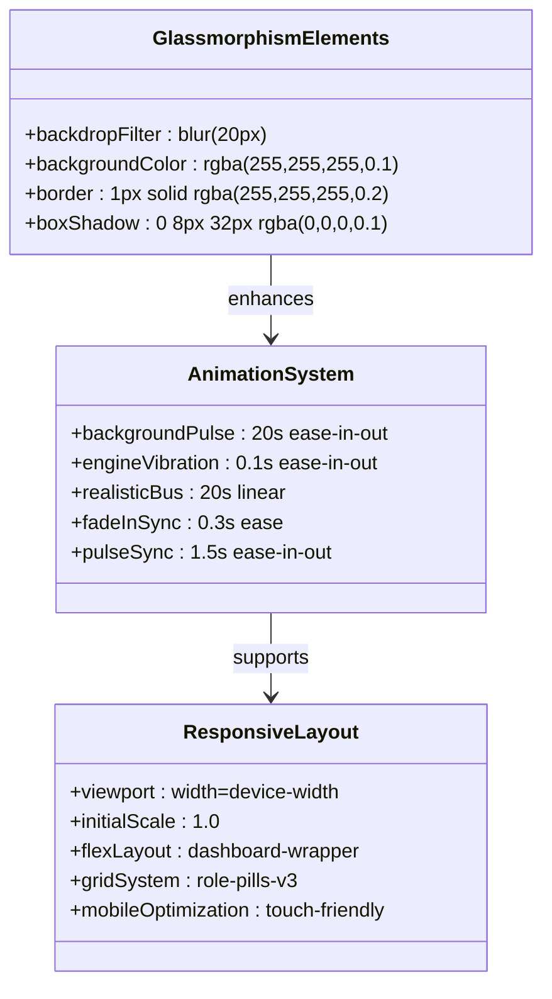

**Diagram sources**
- [style.css:25-153](file://style.css#L25-L153)
- [style.css:426-474](file://style.css#L426-L474)
- [style.css:782-795](file://style.css#L782-L795)

## Dependency Analysis

The system maintains minimal external dependencies while leveraging essential third-party resources:

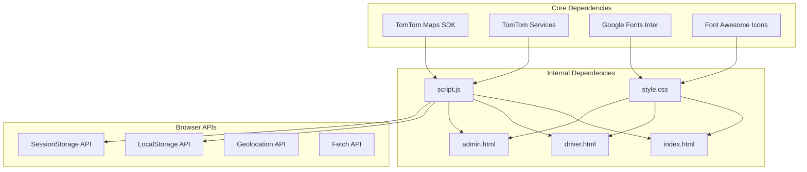

**Diagram sources**
- [index.html:8-12](file://index.html#L8-L12)
- [script.js:1-11](file://script.js#L1-L11)

### External Resource Management

The system efficiently manages external resources through CDN integration:

| Resource Type | Provider | Purpose | Version |
|---------------|----------|---------|---------|
| Maps SDK | TomTom | Base mapping functionality | 6.25.0 |
| Services SDK | TomTom | Routing and search services | 6.25.0 |
| Font Library | Google Fonts | Typography system | Inter v4 |
| Icon System | Font Awesome | UI enhancement icons | 6.4.0 |

**Section sources**
- [index.html:8-12](file://index.html#L8-L12)
- [driver.html:8](file://driver.html#L8)

## Performance Considerations

The BusTrack MB Pro system implements several performance optimization strategies:

### Memory Management
- **Object Pooling**: Reusable marker and layer objects prevent memory leaks
- **Lazy Loading**: Map components initialized only when needed
- **Event Delegation**: Efficient event handling reduces memory footprint

### Network Optimization
- **API Caching**: Strategic caching of frequently accessed locations
- **Batch Operations**: Combined updates reduce network requests
- **Connection Pooling**: Optimized TomTom API usage patterns

### Rendering Performance
- **CSS Animations**: Hardware-accelerated animations for smooth transitions
- **Debounced Updates**: Prevents excessive UI refresh cycles
- **Selective Re-rendering**: Only affected components updated

## Troubleshooting Guide

### Common Issues and Solutions

**Map Loading Problems**
- Verify TomTom API key validity
- Check network connectivity to CDN resources
- Ensure viewport meta tag is present

**Authentication Failures**
- Confirm role selection matches credentials
- Validate username/password combinations
- Check browser storage permissions

**Route Calculation Errors**
- Verify location coordinates are within Mira Bhayandar bounds
- Ensure TomTom API quota is available
- Check for network timeouts during API calls

**Performance Issues**
- Clear browser cache and cookies
- Disable ad blockers affecting CDN resources
- Check for conflicting browser extensions

### Debugging Tools

The system includes built-in debugging capabilities:
- Console logging for API responses
- Toast notifications for user feedback
- State inspection through browser developer tools

**Section sources**
- [script.js:358-363](file://script.js#L358-L363)
- [script.js:557-569](file://script.js#L557-L569)

## Conclusion

BusTrack MB Pro represents a comprehensive solution for modern school transportation management in Mira Bhayandar. The system successfully combines real-time tracking capabilities with intuitive user interfaces, all while maintaining excellent performance and user experience standards.

The multi-role architecture ensures appropriate access control while providing specialized functionality for each stakeholder group. The integration of TomTom's advanced mapping services delivers reliable route optimization and ETA calculations, while the glassmorphism design creates a visually appealing and modern interface.

Key strengths of the system include:
- **Scalable Architecture**: Modular design supports future enhancements
- **Robust Data Management**: Client-side persistence ensures reliability
- **Responsive Design**: Universal accessibility across devices
- **Performance Optimization**: Efficient resource utilization and loading

The system provides a solid foundation for fleet management operations and can be extended to support additional features such as real-time passenger tracking, automated reporting, and expanded geographic coverage.