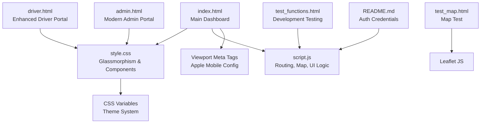
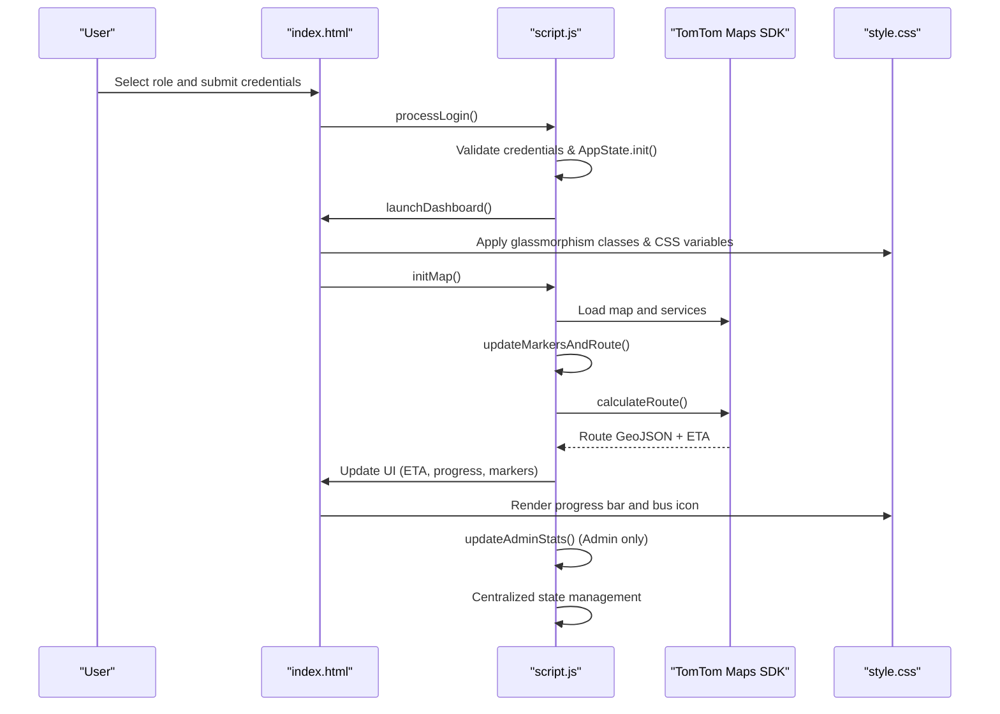
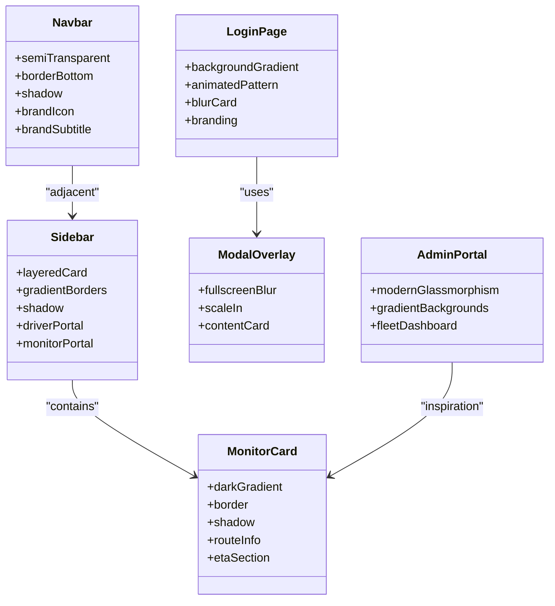
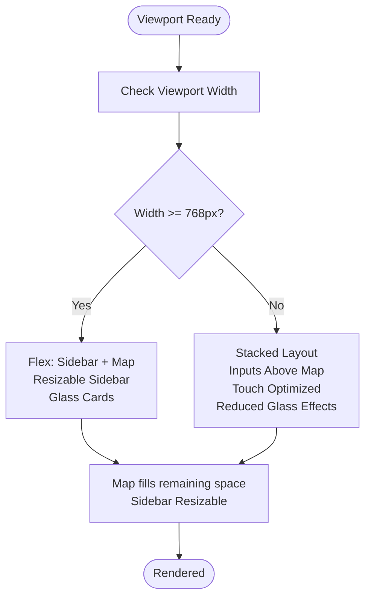
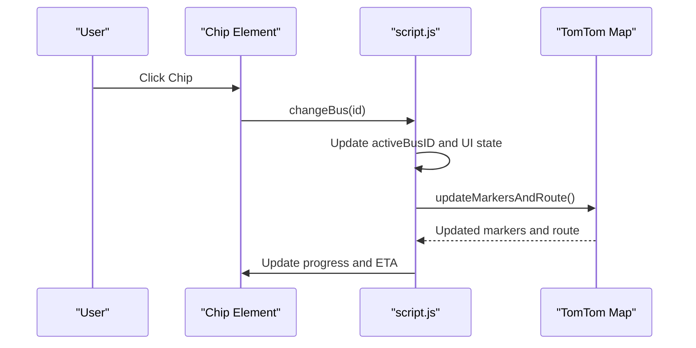
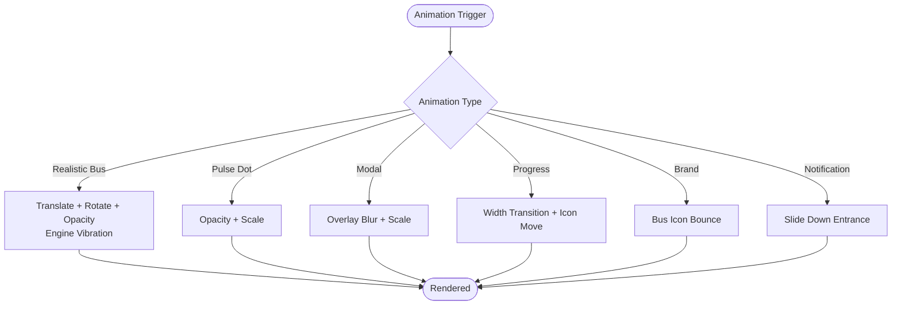
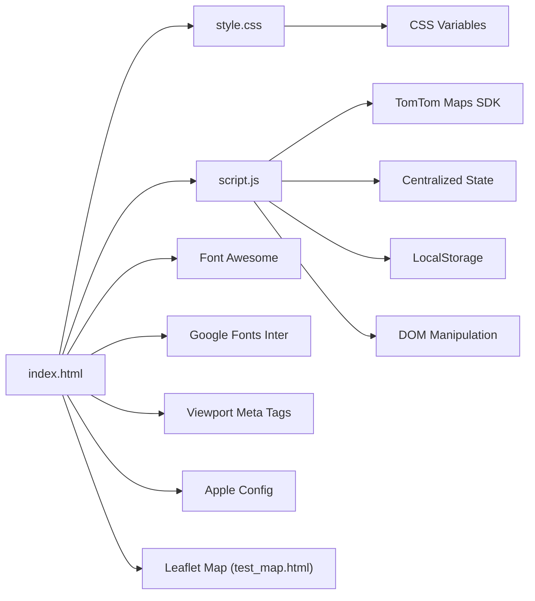

# User Interface and Design System

<cite>
**Referenced Files in This Document**
- [style.css](file://style.css)
- [script.js](file://script.js)
- [index.html](file://index.html)
- [admin.html](file://admin.html)
- [driver.html](file://driver.html)
- [test_map.html](file://test_map.html)
- [test_functions.html](file://test_functions.html)
- [README.md](file://README.md)
</cite>

## Update Summary
**Changes Made**
- Updated to reflect complete redesign with modern glass-morphism interface featuring gradient backgrounds and Frosted Glass effects
- Added comprehensive Google Fonts Inter integration for typography
- Enhanced admin portal with modern glass-morphism design and fleet management dashboard
- Updated driver portal with Font Awesome integration and enhanced trip configuration
- Improved responsive layout implementation with advanced viewport meta tags and Apple mobile configurations
- Added comprehensive CSS variable system for theme customization across all user roles
- Enhanced real-time statistics display with live fleet monitoring capabilities

## Table of Contents
1. [Introduction](#introduction)
2. [Project Structure](#project-structure)
3. [Core Components](#core-components)
4. [Architecture Overview](#architecture-overview)
5. [Detailed Component Analysis](#detailed-component-analysis)
6. [Dependency Analysis](#dependency-analysis)
7. [Performance Considerations](#performance-considerations)
8. [Troubleshooting Guide](#troubleshooting-guide)
9. [Conclusion](#conclusion)
10. [Appendices](#appendices)

## Introduction
This document describes the modern UI design system and user interface components for the BusTrack Pro application. The system features a complete redesign with glass-morphism design principles, frosted glass effects, subtle shadows, and transparent elements. The interface supports desktop and mobile devices with advanced viewport meta tags and Apple mobile web app configurations. The design system utilizes Google Fonts Inter for typography and integrates Font Awesome icons for enhanced visual communication. Interactive elements include chips for bus selection, custom markers with gradient effects and glow animations, and modal dialogs for confirmations. The CSS variable system provides comprehensive theme customization, while the component-based styling approach ensures visual consistency across different user roles. The animation system delivers smooth transitions, progress indicators, and user feedback mechanisms. The system includes a comprehensive fleet management dashboard featuring real-time bus information, visual status indicators, and improved typography.

## Project Structure
The project consists of multiple HTML pages and shared CSS/JS assets with enhanced mobile responsiveness and modern design patterns:
- index.html: Main dashboard with login, navigation, sidebar fleet controls, map view, toast notifications, and real-time statistics
- style.css: Central stylesheet defining glassmorphism, animations, components, and modals with comprehensive CSS variable system
- script.js: Application logic for authentication, routing, map rendering, data synchronization, and UI updates with centralized state management
- admin.html: Complete redesign with modern glass-morphism interface, gradient backgrounds, and fleet management dashboard
- driver.html: Enhanced driver portal with Font Awesome icons, autocomplete functionality, GPS location integration, and trip configuration
- test_map.html: Standalone map test page using Leaflet for offline verification
- test_functions.html: Development testing utility for function validation
- README.md: Authentication credentials and system behavior documentation

**Diagram sources**
- [index.html:14-141](file://index.html#L14-L141)
- [style.css:1-901](file://style.css#L1-L901)
- [script.js:1-938](file://script.js#L1-L938)
- [driver.html:1-732](file://driver.html#L1-L732)
- [admin.html:1-191](file://admin.html#L1-L191)
- [test_map.html:1-51](file://test_map.html#L1-L51)
- [test_functions.html:1-32](file://test_functions.html#L1-L32)
- [README.md:1-45](file://README.md#L1-L45)

**Section sources**
- [index.html:14-141](file://index.html#L14-L141)
- [style.css:1-901](file://style.css#L1-L901)
- [script.js:1-938](file://script.js#L1-L938)
- [driver.html:1-732](file://driver.html#L1-L732)
- [admin.html:1-191](file://admin.html#L1-L191)
- [test_map.html:1-51](file://test_map.html#L1-L51)
- [test_functions.html:1-32](file://test_functions.html#L1-L32)
- [README.md:1-45](file://README.md#L1-L45)

## Core Components
- **Glassmorphism UI**: Login card, navigation bar, sidebar, monitor card, and modal overlays use backdrop blur, semi-transparent backgrounds, and layered borders to achieve a premium translucent appearance
- **Interactive Chips**: Bus selection chips support hover, active states, and dynamic styling updates with role-specific variations
- **Custom Markers**: Route markers use gradient backgrounds and soft glows; route layers include glow and highlight effects
- **Modal Dialogs**: Confirmation modal overlays animate in with scale and blur effects
- **Progress Indicators**: ETA progress bars with animated bus icon movement along the route
- **Toast Notifications**: Non-blocking feedback messages appear at the top-right corner
- **Responsive Layout**: Flexbox-based layouts adapt to viewport sizes with advanced viewport meta tags and Apple mobile configurations
- **Real-time Statistics**: Admin dashboard displays live fleet metrics with active bus counts and status indicators
- **Enhanced Driver Portal**: Driver interface with Font Awesome icons, autocomplete search, GPS location integration, and trip configuration
- **Modern Typography**: Google Fonts Inter integration for clean, modern readability across all interfaces
- **Gradient Backgrounds**: Sophisticated gradient color schemes for different user roles and interface elements

**Section sources**
- [style.css:138-153](file://style.css#L138-L153)
- [style.css:365-425](file://style.css#L365-L425)
- [style.css:522-548](file://style.css#L522-L548)
- [style.css:761-768](file://style.css#L761-L768)
- [style.css:783-795](file://style.css#L783-L795)
- [index.html:5-6](file://index.html#L5-L6)
- [index.html:74-83](file://index.html#L74-L83)

## Architecture Overview
The application follows a component-based architecture with centralized state management and modern design patterns:
- HTML defines containers and components (chips, inputs, buttons, modals) with enhanced mobile configurations and role-specific interfaces
- CSS applies glassmorphism, animations, and responsive layouts with comprehensive CSS variable system for theme customization
- JavaScript orchestrates routing, map rendering, data persistence, UI updates, and real-time statistics with role-based access control
- The system supports three distinct user roles: Admin, Driver, and Parent, each with specialized interfaces and functionality

**Diagram sources**
- [index.html:31-139](file://index.html#L31-L139)
- [script.js:76-152](file://script.js#L76-L152)
- [script.js:367-570](file://script.js#L367-L570)
- [style.css:744-768](file://style.css#L744-L768)

## Detailed Component Analysis

### Glassmorphism Design System
The modern glass-morphism design system creates a premium translucent interface with sophisticated visual depth:
- **Login Page**: Animated background with radial gradients and pulsing animation; translucent login card with backdrop blur and layered borders
- **Navigation Bar**: Semi-transparent bar with subtle border and shadow for depth, featuring new brand icon and subtitle with bounce animation
- **Sidebar and Monitor Card**: Layered cards with gradient backgrounds, borders, and shadows with enhanced driver portal integration
- **Modal Overlay**: Fullscreen overlay with blur and fade-in scale animation
- **Admin Portal**: Complete redesign with modern glass-morphism interface featuring gradient backgrounds and sophisticated card layouts

**Diagram sources**
- [style.css:25-55](file://style.css#L25-L55)
- [style.css:138-153](file://style.css#L138-L153)
- [style.css:365-425](file://style.css#L365-L425)
- [style.css:484-507](file://style.css#L484-L507)
- [style.css:702-709](file://style.css#L702-L709)
- [style.css:800-841](file://style.css#L800-L841)
- [admin.html:10-118](file://admin.html#L10-L118)

**Section sources**
- [style.css:25-55](file://style.css#L25-L55)
- [style.css:138-153](file://style.css#L138-L153)
- [style.css:365-425](file://style.css#L365-L425)
- [style.css:484-507](file://style.css#L484-L507)
- [style.css:702-709](file://style.css#L702-L709)
- [style.css:800-841](file://style.css#L800-L841)
- [admin.html:10-118](file://admin.html#L10-L118)

### Responsive Layout Implementation
The responsive layout implementation uses advanced viewport meta tags and modern CSS techniques:
- Flexbox-based navigation and dashboard layout adapt to viewport height and width with advanced viewport meta tags
- Viewport meta tags ensure mobile scaling with `initial-scale=1.0, maximum-scale=1.0, user-scalable=no` for optimal touch experience
- Apple mobile web app configurations include `mobile-web-app-capable`, `apple-mobile-web-app-capable`, and `apple-mobile-web-app-status-bar-style`
- Inputs and buttons maintain consistent padding and sizing across devices with enhanced driver portal integration
- Map container fills available space with explicit sizing and responsive sidebar with resizable capability
- Glass-morphism cards adapt seamlessly across different screen sizes with appropriate spacing and typography scaling

**Diagram sources**
- [index.html:5-6](file://index.html#L5-L6)
- [style.css:477-481](file://style.css#L477-L481)
- [style.css:771-780](file://style.css#L771-L780)

**Section sources**
- [index.html:5-6](file://index.html#L5-L6)
- [style.css:477-481](file://style.css#L477-L481)
- [style.css:771-780](file://style.css#L771-L780)

### Color Scheme and Typography
The modern color scheme and typography system provides visual consistency across all interfaces:
- **Color Palette**:
  - Dark background: #0f172a (primary dark theme)
  - Light backgrounds: #f1f5f9, #ffffff (light theme)
  - Accent blues: #2563eb, #3b82f6 (admin theme)
  - Success/green: #34d399, #10b981 (driver theme)
  - Warning/yellow: #f59e0b (driver theme)
  - Danger/red: #ef4444 (admin theme)
  - Driver theme: #0ea5e9, #0284c7 (blue minimal theme)
  - Parent theme: #fef3c7, #fde68a (soft pink/yellow theme)
- **Typography**: Inter font from Google Fonts for clean, modern readability across all interfaces
- **Brand Identity**: Enhanced brand typography with bus icon and subtitle in navigation, featuring bounce animation
- **Icon Integration**: Font Awesome integrated in driver.html for action icons, native emoji icons for bus animations

**Section sources**
- [style.css:17](file://style.css#L17)
- [index.html:7](file://index.html#L7)
- [driver.html:8](file://driver.html#L8)

### Interactive Elements
The interactive elements system provides intuitive user experiences across all interfaces:
- **Chips for Bus Selection**: Hover effects, active state styling, and dynamic updates when switching buses with role-specific variations
- **Custom Markers**: Gradient circles with soft glows and centered icons for start/end locations, route layers include glow beneath and highlight inside
- **Modal Dialogs**: Confirmation modal with blur overlay, scale-in animation, and gradient confirm button
- **Driver Portal Enhancements**: Font Awesome icons integration, autocomplete search functionality with TomTom API integration, GPS location button with user location detection
- **Admin Dashboard**: Modern glass-morphism cards with fleet management interface, real-time status indicators, and gradient backgrounds
- **Notification System**: Slide-down animations, badge indicators, and role-specific notification panels

**Diagram sources**
- [style.css:522-548](file://style.css#L522-L548)
- [script.js:639-690](file://script.js#L639-L690)
- [script.js:367-444](file://script.js#L367-L444)

**Section sources**
- [style.css:522-548](file://style.css#L522-L548)
- [script.js:639-690](file://script.js#L639-L690)
- [script.js:367-444](file://script.js#L367-L444)
- [style.css:800-841](file://style.css#L800-L841)

### Animation System
The animation system delivers smooth, engaging user experiences:
- **Realistic Bus Animation**: Continuous road travel with rotation and opacity transitions; ground shadow blur; engine vibration effects
- **Pulse Animations**: Sync status dot pulses; driver current stop marker pulses; live status indicators with smooth pulsing animations
- **Fade and Scale Transitions**: Modal overlay fades in/out and scales up; buttons lift on hover; cards elevate on interaction
- **Progress Indicators**: ETA progress bar fills smoothly; bus icon moves along the bar; enhanced ETA hero card with animated values
- **Brand Animations**: Bus icon bounce animation in navigation; background pattern pulsing in login page
- **Notification Animations**: Slide-down entrance for notification panel; fade-in/fade-out for toast messages

**Diagram sources**
- [style.css:57-128](file://style.css#L57-L128)
- [style.css:458-467](file://style.css#L458-L467)
- [style.css:839-841](file://style.css#L839-L841)
- [style.css:753-759](file://style.css#L753-L759)
- [style.css:662-665](file://style.css#L662-L665)

**Section sources**
- [style.css:57-128](file://style.css#L57-L128)
- [style.css:458-467](file://style.css#L458-L467)
- [style.css:839-841](file://style.css#L839-L841)
- [style.css:753-759](file://style.css#L753-L759)
- [style.css:662-665](file://style.css#L662-L665)

### Component-Based Styling Approach
The component-based styling approach ensures consistency and maintainability:
- **Modular CSS classes** define reusable components: inputs, buttons, pills, chips, progress bars, and cards with role-specific variations
- **Enhanced driver portal components** with Font Awesome integration, autocomplete and GPS functionality
- **Admin portal components** with modern glass-morphism design and fleet management interface
- **Component composition**: Chips are used within fleet lists; progress bars are embedded in monitor cards; driver portal cards contain input groups, ETA displays, and action buttons
- **Consistent spacing and typography**: Uniform font weights and sizes across components with enhanced brand identity using Google Fonts Inter

**Section sources**
- [style.css:194-222](file://style.css#L194-L222)
- [style.css:225-269](file://style.css#L225-L269)
- [style.css:272-310](file://style.css#L272-L310)
- [style.css:522-548](file://style.css#L522-L548)
- [style.css:744-768](file://style.css#L744-L768)

### Theme Customization and CSS Variable System
The comprehensive CSS custom property system enables dynamic theming:
- **Admin theme**: `--admin-bg-primary`, `--admin-accent`, `--admin-gradient` (dark blue/pastel theme)
- **Driver theme**: `--driver-bg-primary`, `--driver-accent`, `--driver-gradient` (blue minimal theme)
- **Parent theme**: `--parent-bg-primary`, `--parent-accent`, `--parent-gradient` (soft pink/yellow theme)
- **Shared design tokens**: `--glass-bg`, `--glass-border`, `--shadow-lg`, `--radius-xl` for consistent glass-morphism effects
- **Dynamic theme application** based on user role with seamless transitions and role-specific styling
- **Future enhancement recommendations** for consistent theming across all components and interface elements

**Section sources**
- [style.css:6-34](file://style.css#L6-L34)

### Real-time Statistics and Admin Dashboard
The enhanced admin dashboard provides comprehensive fleet management:
- **Live fleet monitoring** with total bus count and active bus indicators using status badges with pulse animation
- **Enhanced admin statistics** with real-time updates and live status badges with gradient backgrounds
- **Role-based filtering** of fleet data with centralized state management and localStorage persistence
- **Cross-tab synchronization** for real-time notifications and updates across browser tabs
- **Modern glass-morphism interface** with gradient backgrounds and sophisticated card layouts
- **Fleet management table** with status indicators, route information, and real-time ETA displays

**Section sources**
- [index.html:74-83](file://index.html#L74-L83)
- [script.js:464-477](file://script.js#L464-L477)
- [script.js:266-294](file://script.js#L266-L294)
- [admin.html:132-174](file://admin.html#L132-L174)

### Enhanced Driver Portal Features
The driver portal features Font Awesome integration and comprehensive trip management:
- **Advanced autocomplete search** with TomTom API integration for precise location matching
- **GPS location button** with user geolocation detection and automatic coordinate updates
- **Trip configuration interface** with ETA display and publish tracking functionality
- **Real-time status indicators** and live tracking capabilities with Font Awesome icons
- **Route progress visualization** with completion markers and current stop highlighting
- **Quick action buttons** for common driver operations with gradient backgrounds
- **Shift statistics** display with student count, stop count, and duration metrics

**Section sources**
- [index.html:128-163](file://index.html#L128-L163)
- [script.js:633-769](file://script.js#L633-L769)
- [driver.html:514-732](file://driver.html#L514-L732)

## Dependency Analysis
The system maintains clean dependencies for optimal performance and maintainability:
- **HTML depends on**: Google Fonts Inter for typography, TomTom Maps SDK for routing and map rendering, Font Awesome for driver portal icons, advanced viewport meta tags for mobile optimization
- **CSS depends on**: Backdrop filters for glassmorphism, animations and transforms for interactive effects, CSS variables for theme customization
- **JavaScript depends on**: TomTom services for search and routing, LocalStorage for persistent fleet data, DOM manipulation for UI updates, centralized state management for real-time updates
- **External libraries**: Leaflet for test map functionality, Font Awesome for driver portal icons, TomTom SDK for map services

**Diagram sources**
- [index.html:7-11](file://index.html#L7-L11)
- [driver.html:8](file://driver.html#L8)
- [test_map.html:5-6](file://test_map.html#L5-L6)
- [script.js:1](file://script.js#L1)

**Section sources**
- [index.html:7-11](file://index.html#L7-L11)
- [driver.html:8](file://driver.html#L8)
- [test_map.html:5-6](file://test_map.html#L5-L6)
- [script.js:1](file://script.js#L1)

## Performance Considerations
The system implements several performance optimizations:
- **Minimize DOM reflows** by batching UI updates (already partially addressed by state flags and delayed resets)
- **Use CSS transforms and opacity** for animations to leverage GPU acceleration
- **Debounce frequent UI updates** (e.g., map fitBounds) to reduce layout thrashing
- **Lazy-load external resources** (e.g., fonts and icons) when possible
- **Implement efficient state management** to reduce unnecessary re-renders
- **Optimize TomTom API calls** with debouncing and caching strategies
- **Glass-morphism optimization** using backdrop-filter efficiently on supported browsers
- **Responsive image handling** for map tiles and interface elements

## Troubleshooting Guide
Comprehensive troubleshooting guidance for common issues:
- **Login Issues**: Verify role selection and credentials match predefined users in README.md; check toast messages for access denied feedback
- **Routing Failures**: Ensure both start and destination are set; known locations improve accuracy; network errors are handled with specific messages
- **Map Not Rendering**: Confirm TomTom key availability and network connectivity; for standalone map test, verify Leaflet initialization and tile layer loading
- **Modal Conflicts**: Ensure reset confirmation modal is closed before subsequent actions
- **Sync Paused**: Sync status indicator appears during user interactions; wait for cooldown period of 3 seconds
- **Mobile Responsiveness**: Verify viewport meta tags are properly configured; test on various device sizes and orientations
- **Driver Portal Issues**: GPS location button requires HTTPS for geolocation API; autocomplete search may fail if TomTom API is unavailable
- **Admin Portal Access**: Use credentials from README.md: admin/schooladmin789 for admin access
- **Driver Portal Access**: Use driver credentials from README.md: driver/driver123 for driver access
- **Parent Portal Access**: Use student credentials from README.md (student01-student05) for parent access

**Section sources**
- [script.js:76-112](file://script.js#L76-L112)
- [script.js:228-364](file://script.js#L228-L364)
- [script.js:581-623](file://script.js#L581-L623)
- [test_map.html:30-49](file://test_map.html#L30-L49)
- [script.js:743-778](file://script.js#L743-L778)
- [README.md:1-45](file://README.md#L1-L45)

## Conclusion
The BusTrack Pro design system represents a complete modernization with glass-morphism aesthetics, robust interactivity, and responsive layouts. The modular CSS and component-based approach enables consistent visuals across all three user roles (Admin, Driver, Parent), while animations and feedback mechanisms enhance usability. The enhanced mobile-responsive design with advanced viewport configurations, real-time statistics display, and improved driver portal functionality demonstrates a mature, production-ready interface. The comprehensive CSS variable system and theme customization capabilities ensure visual consistency and flexibility. Extending the system involves introducing additional CSS variables for new themes, adding more component variants, and refining animations for smoother performance. The modern glass-morphism design with gradient backgrounds and sophisticated typography creates a premium user experience that adapts seamlessly across desktop and mobile devices.

## Appendices
- **Additional Pages**:
  - admin.html: Complete redesign with modern glass-morphism interface, gradient backgrounds, and comprehensive fleet management dashboard
  - driver.html: Enhanced driver portal with Font Awesome icons, autocomplete search, GPS location, and dedicated UI with route management
  - test_map.html: Standalone map test using Leaflet for offline verification and development testing
  - test_functions.html: Development testing utility for validating function exports and system functionality
  - README.md: Authentication credentials and system behavior documentation for all user roles

**Section sources**
- [admin.html:1-191](file://admin.html#L1-L191)
- [driver.html:1-732](file://driver.html#L1-L732)
- [test_map.html:1-51](file://test_map.html#L1-L51)
- [test_functions.html:1-32](file://test_functions.html#L1-L32)
- [README.md:1-45](file://README.md#L1-L45)